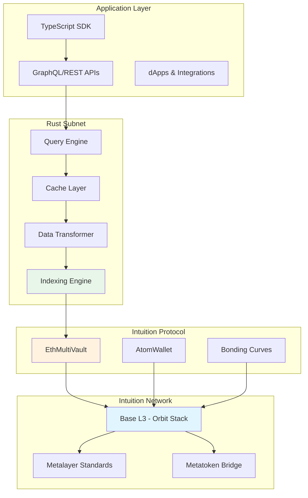
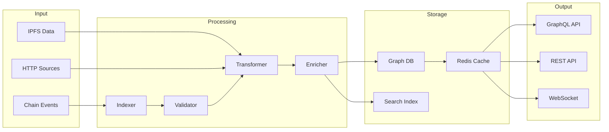

# Technical Architecture

Intuition's architecture consists of three tightly integrated layers that work together to create a high-performance, decentralized knowledge graph. This document provides a technical deep-dive into each layer and how they interconnect.

## Architecture Overview

<div style={{
  backgroundColor: 'var(--ifm-color-emphasis-100)',
  border: '1px solid var(--ifm-color-emphasis-300)',
  borderRadius: '8px',
  padding: '1.5rem',
  margin: '2rem 0',
  borderLeft: '4px solid var(--ifm-color-primary)'
}}>


Intuition's architecture is designed for **speed**, **scale**, and **interoperability**. By separating concerns across three specialized layers, we achieve optimal performance while maintaining decentralization and cross-chain compatibility.

</div>



## Layer 1: Intuition Network (Base L3)

### Overview

The Intuition Network is an **EVM-compatible Layer 3** built on Base using the Orbit stack. This provides the ultra-fast, low-cost transaction environment essential for high-frequency knowledge graph operations.

<div style={{
  backgroundColor: 'var(--ifm-color-emphasis-50)',
  border: '1px solid var(--ifm-color-emphasis-200)',
  borderRadius: '6px',
  padding: '1rem',
  margin: '1rem 0'
}}>

### Why Layer 3?

Traditional L1s and even L2s are too expensive and slow for the granular operations required by a knowledge graph. Every atom creation, triple attestation, and signal update needs to be economically viable. The L3 architecture provides:

- **Sub-cent transaction costs** - Making micro-attestations economically feasible
- **Sub-second finality** - Enabling real-time knowledge graph updates
- **Massive throughput** - Supporting millions of daily knowledge operations
- **EVM compatibility** - Leveraging existing tooling and developer knowledge

</div>

### Technical Specifications

<div style={{
  display: 'grid',
  gridTemplateColumns: 'repeat(auto-fit, minmax(250px, 1fr))',
  gap: '1rem',
  margin: '1.5rem 0'
}}>

<div style={{
  backgroundColor: 'var(--ifm-background-color)',
  border: '1px solid var(--ifm-color-emphasis-300)',
  borderRadius: '8px',
  padding: '1rem'
}}>

**Performance**
- Block time: ~250ms
- Transaction throughput: 10,000+ TPS
- Finality: < 1 second
- Gas costs: < $0.001 per tx

</div>

<div style={{
  backgroundColor: 'var(--ifm-background-color)',
  border: '1px solid var(--ifm-color-emphasis-300)',
  borderRadius: '8px',
  padding: '1rem'
}}>

**Stack Components**
- **Base Layer**: Orbit framework on Base
- **Consensus**: Optimistic rollup with fraud proofs
- **Execution**: EVM-compatible runtime
- **Data Availability**: Base for settlement

</div>

<div style={{
  backgroundColor: 'var(--ifm-background-color)',
  border: '1px solid var(--ifm-color-emphasis-300)',
  borderRadius: '8px',
  padding: '1rem'
}}>

**Interoperability**
- **Metalayer**: Cross-chain messaging protocol
- **Metatoken**: Unified token standard
- **Bridge**: Native Base ↔ L3 bridge
- **Standards**: ERC-1155, ERC-4626, ERC-4337

</div>

</div>

### Cross-Chain Interoperability

The Network leverages **Caldera's Metalayer and Metatoken standards** for seamless cross-chain operations:

```solidity
// Example: Cross-chain atom reference
interface IMetalayerBridge {
    function attestCrossChain(
        uint256 chainId,
        uint256 atomId,
        bytes calldata data
    ) external returns (bytes32 messageId);

    function resolveAtom(
        uint256 chainId,
        uint256 atomId
    ) external view returns (string memory uri);
}
```

This enables atoms and triples to reference data across any supported chain, creating a truly interoperable knowledge graph.

## Layer 2: Intuition Protocol (On-Chain Logic)

### Overview

The Intuition Protocol implements all on-chain logic for the knowledge graph through a suite of smart contracts. This is where atoms are created, triples are formed, and economic incentives are enforced.

### Core Contract Architecture

<div style={{
  backgroundColor: 'var(--ifm-background-surface-color)',
  border: '1px solid var(--ifm-color-emphasis-300)',
  borderRadius: '8px',
  padding: '1.5rem',
  margin: '1.5rem 0'
}}>

#### **EthMultiVault**
The economic engine managing all vault operations:

```solidity
contract EthMultiVault {
    // Core vault operations
    function deployVault(uint256 atomId) external returns (address vault);
    function deposit(uint256 vaultId, uint256 amount) external;
    function redeem(uint256 vaultId, uint256 shares) external;

    // Bonding curve integration
    function calculatePrice(uint256 supply) public view returns (uint256);
    function calculateShares(uint256 deposit, uint256 totalSupply) external view;
}
```

**Key Features:**
- Automated vault deployment for atoms/triples
- Dynamic pricing via bonding curves
- Share-based ownership model
- Fee distribution to stakers

</div>

<div style={{
  backgroundColor: 'var(--ifm-background-surface-color)',
  border: '1px solid var(--ifm-color-emphasis-300)',
  borderRadius: '8px',
  padding: '1.5rem',
  margin: '1.5rem 0'
}}>

#### **AtomWallet**
Primary interface for creating and managing knowledge graph primitives:

```solidity
contract AtomWallet {
    // Atom operations
    function createAtom(string memory uri) external returns (uint256 atomId);

    // Triple operations
    function createTriple(
        uint256 subjectId,
        uint256 predicateId,
        uint256 objectId
    ) external returns (uint256 tripleId);

    // Signal operations
    function depositAtom(uint256 atomId, uint256 amount) external;
    function depositTriple(uint256 tripleId, uint256 amount, bool isPositive) external;
}
```

**Key Features:**
- Gas-efficient batch operations
- Account abstraction support (ERC-4337)
- Multi-signature capabilities
- Upgradeable proxy pattern

</div>

### Economic Mechanics

The Protocol implements sophisticated economic incentives:

<div style={{
  display: 'grid',
  gridTemplateColumns: 'repeat(auto-fit, minmax(300px, 1fr))',
  gap: '1rem',
  margin: '1.5rem 0'
}}>

<div style={{
  backgroundColor: 'var(--ifm-color-emphasis-50)',
  border: '1px solid var(--ifm-color-emphasis-200)',
  borderRadius: '6px',
  padding: '1rem'
}}>

**Bonding Curves**
- Automated price discovery
- Early adopter rewards
- Exponential growth model
- Anti-manipulation mechanics

</div>

<div style={{
  backgroundColor: 'var(--ifm-color-emphasis-50)',
  border: '1px solid var(--ifm-color-emphasis-200)',
  borderRadius: '6px',
  padding: '1rem'
}}>

**Fee Distribution**
- Creator fees: 5% of deposits
- Protocol fees: 2% of deposits
- Staker rewards: Proportional shares
- Compound interest mechanics

</div>

<div style={{
  backgroundColor: 'var(--ifm-color-emphasis-50)',
  border: '1px solid var(--ifm-color-emphasis-200)',
  borderRadius: '6px',
  padding: '1rem'
}}>

**Vault Mechanics**
- Positive/negative signal vaults
- Automatic liquidity provision
- Rage quit protection
- Time-weighted averaging

</div>

</div>

### State Management

The Protocol maintains the complete on-chain state of the knowledge graph:

```typescript
interface OnChainState {
  atoms: Map<number, {
    id: number;
    uri: string;
    vault: address;
    creator: address;
    timestamp: number;
  }>;

  triples: Map<number, {
    id: number;
    subjectId: number;
    predicateId: number;
    objectId: number;
    vaultFor: address;
    vaultAgainst: address;
  }>;

  signals: Map<address, Map<number, {
    shares: bigint;
    lastUpdate: number;
  }>>;
}
```

## Layer 3: Rust Subnet (Off-Chain Infrastructure)

### Overview

The Rust Subnet is Intuition's high-performance off-chain infrastructure that indexes on-chain state, resolves off-chain data references, and serves the unified knowledge graph through APIs.

<div style={{
  backgroundColor: 'var(--ifm-color-emphasis-100)',
  border: '1px solid var(--ifm-color-emphasis-300)',
  borderRadius: '8px',
  padding: '1.5rem',
  margin: '1.5rem 0',
  borderLeft: '4px solid var(--ifm-color-primary)'
}}>

**Why Rust?**

The Subnet is built in Rust for maximum performance and reliability:
- **Memory safety** without garbage collection
- **Concurrent processing** for parallel indexing
- **Zero-cost abstractions** for efficient data structures
- **WebAssembly compatibility** for edge deployment

</div>

### Core Components

<div style={{
  display: 'grid',
  gridTemplateColumns: 'repeat(auto-fit, minmax(300px, 1fr))',
  gap: '1.5rem',
  margin: '2rem 0'
}}>

<div style={{
  backgroundColor: 'var(--ifm-background-color)',
  border: '1px solid var(--ifm-color-emphasis-300)',
  borderRadius: '8px',
  padding: '1.5rem'
}}>

#### **Event Processing Pipeline**

Processes blockchain events through multiple stages:

```rust
// Consumer modes for different processing stages
pub enum ConsumerMode {
    Raw(RawConsumerContext),           // Raw event ingestion
    Decoded(DecodedConsumerContext),   // Event decoding
    Resolver(ResolverConsumerContext), // Data resolution
}

impl ConsumerMode {
    pub async fn process_message(&self, message: String) -> Result<(), ConsumerError> {
        match self {
            ConsumerMode::Raw(context) => {
                self.raw_message_store_and_relay(message, context).await
            }
            ConsumerMode::Decoded(context) => {
                self.handle_decoded_message(message, context).await
            }
            ConsumerMode::Resolver(context) => {
                self.handle_resolved_message(message, context).await
            }
        }
    }
}
```

- Real-time event processing through SQS queues
- Multi-stage pipeline (Raw → Decoded → Resolved)
- Chain reorganization handling
- Parallel processing across consumers

</div>

<div style={{
  backgroundColor: 'var(--ifm-background-color)',
  border: '1px solid var(--ifm-color-emphasis-300)',
  borderRadius: '8px',
  padding: '1.5rem'
}}>

#### **Data Resolver**

Resolves and enriches on-chain references with off-chain data:

```rust
pub struct ResolverConsumerContext {
    pub client: Arc<dyn BasicConsumer>,
    pub image_guard_url: String,
    pub ipfs_resolver: IPFSResolver,
    pub mainnet_client: Arc<ENSRegistryInstance<Http<Client>, RootProvider<Http<Client>>>>,
    pub pg_pool: PgPool,
    pub reqwest_client: reqwest::Client,
}

impl ResolverConsumerContext {
    pub async fn resolve_atom_data(&self, atom_uri: &str) -> Result<ResolvedData, ConsumerError> {
        match atom_uri {
            uri if uri.starts_with("ipfs://") => {
                self.ipfs_resolver.fetch_content(uri).await
            }
            uri if uri.starts_with("http") => {
                self.reqwest_client.get(uri).send().await?.json().await
            }
            addr if is_ethereum_address(addr) => {
                self.resolve_ens_name(addr).await
            }
        }
    }
}
```

- IPFS content resolution via Pinata
- HTTP/HTTPS metadata fetching
- ENS name resolution on mainnet
- Image validation through image-guard service

</div>

<div style={{
  backgroundColor: 'var(--ifm-background-color)',
  border: '1px solid var(--ifm-color-emphasis-300)',
  borderRadius: '8px',
  padding: '1.5rem'
}}>

#### **Database Integration**

Processes and stores structured data for API consumption:

```rust
pub struct DecodedConsumerContext {
    pub base_client: Arc<EthMultiVaultInstance<Http<Client>, RootProvider<Http<Client>>>>,
    pub pg_pool: PgPool,
    pub backend_schema: String,
}

impl DecodedConsumerContext {
    pub async fn handle_decoded_message(&self, message: DecodedMessage) -> Result<(), ConsumerError> {
        match &message.body {
            EthMultiVaultEvents::AtomCreated(atom_data) => {
                atom_data.handle_atom_creation(self, &message).await?;
            }
            EthMultiVaultEvents::TripleCreated(triple_data) => {
                triple_data.handle_triple_creation(self, &message).await?;
            }
            EthMultiVaultEvents::Deposited(deposit_data) => {
                deposit_data.handle_deposit_creation(self, &message).await?;
            }
        }
        Ok(())
    }
}
```

- PostgreSQL with Hasura GraphQL layer
- Real-time event storage and indexing
- Complex relationship mapping
- Optimized queries with database migrations

</div>

</div>

### Data Pipeline

The Subnet implements a sophisticated data pipeline:



### API Layer

The Subnet exposes multiple API interfaces:

<div style={{
  display: 'grid',
  gridTemplateColumns: 'repeat(auto-fit, minmax(300px, 1fr))',
  gap: '1rem',
  margin: '1.5rem 0'
}}>

<div style={{
  backgroundColor: 'var(--ifm-color-emphasis-50)',
  border: '1px solid var(--ifm-color-emphasis-200)',
  borderRadius: '6px',
  padding: '1rem'
}}>

**GraphQL API**
```graphql
query GetAtomWithTriples {
  atom(id: "123") {
    uri
    vault {
      totalStaked
      sharePrice
    }
    triplesAsSubject {
      predicate { uri }
      object { uri }
      signal
    }
  }
}
```

</div>

<div style={{
  backgroundColor: 'var(--ifm-color-emphasis-50)',
  border: '1px solid var(--ifm-color-emphasis-200)',
  borderRadius: '6px',
  padding: '1rem'
}}>

**REST API**
```http
GET /api/v1/atoms/123
GET /api/v1/triples?subject=123
POST /api/v1/search
WebSocket /ws/subscriptions
```

</div>

<div style={{
  backgroundColor: 'var(--ifm-color-emphasis-50)',
  border: '1px solid var(--ifm-color-emphasis-200)',
  borderRadius: '6px',
  padding: '1rem'
}}>

**Real-time Subscriptions**
```typescript
subscription OnAtomUpdate {
  atomUpdated(id: "123") {
    signal
    lastActivity
    vaultBalance
  }
}
```

</div>

</div>

## Data Flow Architecture

### Transaction Lifecycle

Understanding how data flows through the system is crucial for developers:

<div style={{
  backgroundColor: 'var(--ifm-background-surface-color)',
  border: '1px solid var(--ifm-color-emphasis-300)',
  borderRadius: '12px',
  padding: '2rem',
  margin: '2rem 0'
}}>

1. **User Action** → SDK creates transaction
2. **Network Processing** → L3 validates and includes in block
3. **Protocol Execution** → Smart contracts update state
4. **Event Emission** → Contracts emit events
5. **Subnet Indexing** → Events processed and indexed
6. **Data Resolution** → Off-chain data fetched and cached
7. **API Response** → Unified data served to applications

**Average End-to-End Latency: < 2 seconds**

</div>

### State Synchronization

The system maintains consistency across all layers:

```typescript
interface SyncStrategy {
  // Real-time sync for recent blocks
  realtimeSync: {
    blockLag: 2,
    confirmations: 1,
    retryPolicy: ExponentialBackoff
  };

  // Batch sync for historical data
  batchSync: {
    chunkSize: 1000,
    parallelWorkers: 10,
    checkpointInterval: 100
  };

  // Consistency checks
  validation: {
    stateRootVerification: true,
    periodicReconciliation: '1h',
    alertThreshold: 0.001 // 0.1% discrepancy
  };
}
```

## Performance Optimizations

### Caching Strategy

Multi-layer caching for optimal performance:

<div style={{
  display: 'grid',
  gridTemplateColumns: 'repeat(auto-fit, minmax(250px, 1fr))',
  gap: '1rem',
  margin: '1.5rem 0'
}}>

<div style={{
  backgroundColor: 'var(--ifm-color-emphasis-50)',
  border: '1px solid var(--ifm-color-emphasis-200)',
  borderRadius: '6px',
  padding: '0.75rem'
}}>

**L1: CDN Edge Cache**
- Static content
- Popular queries
- 5-minute TTL

</div>

<div style={{
  backgroundColor: 'var(--ifm-color-emphasis-50)',
  border: '1px solid var(--ifm-color-emphasis-200)',
  borderRadius: '6px',
  padding: '0.75rem'
}}>

**L2: Redis Cache**
- Query results
- Session data
- 1-hour TTL

</div>

<div style={{
  backgroundColor: 'var(--ifm-color-emphasis-50)',
  border: '1px solid var(--ifm-color-emphasis-200)',
  borderRadius: '6px',
  padding: '0.75rem'
}}>

**L3: Application Cache**
- Computed values
- Aggregate data
- 24-hour TTL

</div>

</div>

### Query Optimization

The Subnet employs sophisticated query optimization:

- **Query planning** - Analyzes queries to determine optimal execution path
- **Parallel execution** - Breaks queries into independent subqueries
- **Index utilization** - Maintains specialized indexes for common patterns
- **Result streaming** - Streams large results instead of loading all at once

## Security Architecture

### Smart Contract Security

- **Audited contracts** by leading security firms
- **Upgradeable proxies** with time-locked admin functions
- **Rate limiting** on sensitive operations
- **Emergency pause** functionality

### API Security

- **JWT authentication** for protected endpoints
- **Rate limiting** per API key
- **DDoS protection** at edge layer
- **Input validation** and sanitization

### Data Integrity

- **Merkle proofs** for on-chain data
- **IPFS content addressing** for immutable references
- **Signature verification** for attestations
- **Consensus validation** across indexer nodes

## Development Patterns

### Recommended Integration Flow

<div style={{
  backgroundColor: 'var(--ifm-color-emphasis-100)',
  border: '1px solid var(--ifm-color-emphasis-300)',
  borderRadius: '8px',
  padding: '1.5rem',
  margin: '2rem 0',
  borderLeft: '4px solid var(--ifm-color-primary)'
}}>

For developers building on Intuition, we recommend:

1. **Use the TypeScript SDK** for all contract interactions
2. **Query via GraphQL** for complex data needs
3. **Subscribe to WebSockets** for real-time updates
4. **Cache aggressively** at the application layer
5. **Batch operations** when possible to reduce costs

</div>

### Example: Creating and Querying Atoms

```typescript
// Using the SDK to create an atom
const atom = await intuition.createAtom({
  uri: 'ipfs://QmXoypizjW3WknFiJnKLwHCnL72vedxjQkDDP1mXWo6uco'
});

// Staking on the atom
await intuition.stake(atom.id, parseEther('100'));

// Querying via GraphQL
const query = gql`
  query GetAtom($id: ID!) {
    atom(id: $id) {
      uri
      creator
      vault {
        totalStaked
        holders
      }
      signal
    }
  }
`;

const result = await client.query({
  query,
  variables: { id: atom.id }
});
```

## Deployment Architecture

### Infrastructure Setup

<div style={{
  display: 'grid',
  gridTemplateColumns: 'repeat(auto-fit, minmax(300px, 1fr))',
  gap: '1rem',
  margin: '1.5rem 0'
}}>

<div style={{
  backgroundColor: 'var(--ifm-background-color)',
  border: '1px solid var(--ifm-color-emphasis-300)',
  borderRadius: '8px',
  padding: '1rem'
}}>

**Network Nodes**
- Distributed globally
- Auto-scaling groups
- Multi-region failover
- 99.99% uptime SLA

</div>

<div style={{
  backgroundColor: 'var(--ifm-background-color)',
  border: '1px solid var(--ifm-color-emphasis-300)',
  borderRadius: '8px',
  padding: '1rem'
}}>

**Subnet Infrastructure**
- Kubernetes clusters
- Horizontal pod autoscaling
- Rolling deployments
- Blue-green releases

</div>

<div style={{
  backgroundColor: 'var(--ifm-background-color)',
  border: '1px solid var(--ifm-color-emphasis-300)',
  borderRadius: '8px',
  padding: '1rem'
}}>

**Data Storage**
- PostgreSQL with replication
- Redis sentinel clusters
- IPFS pinning services
- S3-compatible object storage

</div>

</div>

## Next Steps

Ready to start building? Explore these resources:

<div style={{
  display: 'grid',
  gridTemplateColumns: 'repeat(auto-fit, minmax(250px, 1fr))',
  gap: '1rem',
  marginTop: '2rem'
}}>

<div style={{
  border: '1px solid var(--ifm-color-emphasis-300)',
  borderRadius: '6px',
  padding: '1rem',
  backgroundColor: 'var(--ifm-background-color)'
}}>

**[Smart Contracts](/docs/intuition-smart-contracts)** - Deep dive into Protocol contracts

</div>

<div style={{
  border: '1px solid var(--ifm-color-emphasis-300)',
  borderRadius: '6px',
  padding: '1rem',
  backgroundColor: 'var(--ifm-background-color)'
}}>

**[GraphQL API](/docs/graphql-api/overview)** - Learn the query interface

</div>

<div style={{
  border: '1px solid var(--ifm-color-emphasis-300)',
  borderRadius: '6px',
  padding: '1rem',
  backgroundColor: 'var(--ifm-background-color)'
}}>

**[SDK Guide](/docs/intuition-sdk/quick-start)** - Start building applications

</div>

<div style={{
  border: '1px solid var(--ifm-color-emphasis-300)',
  borderRadius: '6px',
  padding: '1rem',
  backgroundColor: 'var(--ifm-background-color)'
}}>

**[Deployments](/docs/intuition-smart-contracts/deployments)** - Contract addresses

</div>

</div>