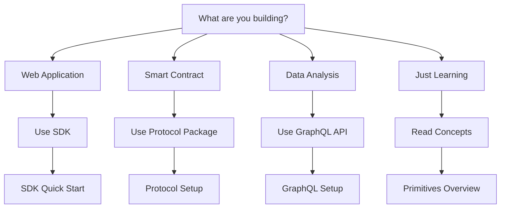

# Choose Your Path

Not sure where to start? Pick the path that matches your goal.

## I Want to...

### Build a Frontend App (Most Common)

**Use the SDK** - High-level TypeScript SDK with React hooks.

- Best for: Web apps, dashboards, social platforms
- Abstracts complexity
- React integration ready
- **Start here:** [SDK Quick Start](/docs/intuition-sdk/quick-start)

### Query Data Only (No Writes)

**Use GraphQL API** - Read-only queries for the knowledge graph.

- Best for: Analytics, dashboards, data visualization
- No wallet needed for reads
- Powerful filtering and aggregation
- **Start here:** [GraphQL Setup](/docs/graphql-api/getting-started/client-setup)

### Build Smart Contract Integration

**Use Protocol Package** - Low-level contract interactions.

- Best for: Other smart contracts, custom logic, gas optimization
- Direct contract calls
- Full control
- **Start here:** [Protocol Configuration](/docs/protocol/getting-started/configuration)

### Understand the System First

**Read Concepts** - Learn how Intuition works.

- Atoms, Triples, Signals
- Economics and incentives
- Architecture
- **Start here:** [Primitives Overview](/docs/intuition-concepts/primitives)

### See Complete Examples

**Follow Tutorials** - Build real applications step-by-step.

- Reputation system
- Curated lists
- Social attestations
- **Start here:** [Tutorials](/docs/tutorials/overview)

## Decision Tree

### Build a Frontend App (Most Common)

**Use the SDK** - High-level TypeScript SDK with React hooks.

- Best for: Web apps, dashboards, social platforms
- Abstracts complexity
- React integration ready

<a class="button button--primary" href="/docs/docs/intuition-sdk/getting-started/quick-start">Start with SDK Quick Start →</a>

### Query Data Only (No Writes)

**Use GraphQL API** - Read-only queries for the knowledge graph.

- Best for: Analytics, dashboards, data visualization
- No wallet needed for reads
- Powerful filtering and aggregation

<a class="button button--primary" href="/docs/docs/graphql-api/getting-started/client-setup">Start with GraphQL Setup →</a>

### Build Smart Contract Integration

**Use Protocol Package** - Low-level contract interactions.

- Best for: Other smart contracts, custom logic, gas optimization
- Direct contract calls
- Full control

<a class="button button--primary" href="/docs/docs/protocol/getting-started/configuration">Start with Protocol Configuration →</a>

### Understand the System First

**Read Concepts** - Learn how Intuition works.

- Atoms, Triples, Signals
- Economics and incentives
- Architecture

<a class="button button--primary" href="/docs/docs/intuition-concepts/overview">Start with Primitives Overview →</a>

### See Complete Examples

**Follow Tutorials** - Build real applications step-by-step.

- Reputation system
- Curated lists
- Social attestations

<a class="button button--primary" href="/docs/docs/tutorials/overview">Start with Tutorials →</a>

## Comparison Table

| Goal | Tool | Complexity | Best For |
|------|------|-----------|----------|
| Build web app | SDK | Low | Frontend developers |
| Query data | GraphQL | Low | Analytics, read-only |
| Contract integration | Protocol | High | Solidity developers |
| Learn system | Concepts | N/A | Everyone |

## Still Unsure?

Join our [Discord](https://discord.gg/RgBenkX4mx) and ask the community!

## Next Steps

Once you've chosen your path:

1. Follow the quick start guide for your chosen tool
2. Read through the [Core Concepts](/docs/intuition-concepts/primitives)
3. Try a [Tutorial](/docs/tutorials/overview)
4. Join the [Community](/docs/resources/community-and-support)
