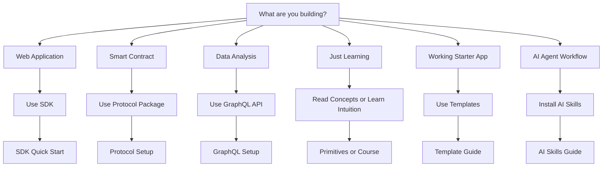

# Choose Your Path

Not sure where to start? Pick the path that matches your goal.

## I Want to...

### Build a Frontend App (Most Common)

**Use the SDK** - High-level TypeScript SDK with React hooks.

- Best for: Web apps, dashboards, social platforms
- Abstracts complexity
- React integration ready
- **Start here:** [SDK Quick Start](/docs/intuition-sdk/quick-start)

### Query Data Only (No Writes)

**Use GraphQL API** - Read-only queries for the knowledge graph.

- Best for: Analytics, dashboards, data visualization
- No wallet needed for reads
- Powerful filtering and aggregation
- **Start here:** [GraphQL Setup](/docs/graphql-api/getting-started/client-setup)

### Build Smart Contract Integration

**Use Protocol Package** - Low-level contract interactions.

- Best for: Other smart contracts, custom logic, gas optimization
- Direct contract calls
- Full control
- **Start here:** [Protocol Configuration](/docs/protocol/getting-started/configuration)

### Understand the System First

**Read Concepts** - Learn how Intuition works.

- Atoms, Triples, Signals
- Economics and incentives
- Architecture
- **Start here:** [Primitives Overview](/docs/intuition-concepts/primitives)

### Learn Through a Guided Course

**Use Learn Intuition** - Interactive Claude Code course for protocol onboarding.

- Best for: Structured onboarding, AI-assisted learning, capstone practice
- Covers atoms, triples, signals, reads, writes, and app building
- **Start here:** [Learn Intuition](/docs/getting-started/learn-intuition)

### Start from a Working App

**Use Templates** - Fork an official starter app.

- Best for: Faster app starts, direct protocol exploration, production-style examples
- Includes agent-readable project context
- **Start here:** [Templates](/docs/getting-started/templates)

### Build with an AI Agent

**Install AI Skills** - Give your agent canonical Intuition protocol context.

- Best for: Claude Code, Codex, Cursor, and compatible agents
- Produces canonical protocol context and unsigned transaction parameters
- **Start here:** [AI Skills](/docs/getting-started/ai-skills)

### See Complete Examples

**Follow Tutorials** - Build real applications step-by-step.

- Reputation system
- Curated lists
- Social attestations
- **Start here:** [Tutorials](/docs/tutorials/overview)

## Decision Tree

```mermaid
graph TD
    A[What are you building?] --> B[Web Application]
    A --> C[Smart Contract]
    A --> D[Data Analysis]
    A --> E[Just Learning]
    A --> N[Working Starter App]
    A --> O[AI Agent Workflow]

    B --> F[Use SDK]
    C --> G[Use Protocol Package]
    D --> H[Use GraphQL API]
    E --> I[Read Concepts or Learn Intuition]
    N --> P[Use Templates]
    O --> Q[Install AI Skills]

    F --> J[SDK Quick Start]
    G --> K[Protocol Setup]
    H --> L[GraphQL Setup]
    I --> M[Primitives or Course]
    P --> R[Template Guide]
    Q --> S[AI Skills Guide]
```

### Build a Frontend App (Most Common)

**Use the SDK** - High-level TypeScript SDK with React hooks.

- Best for: Web apps, dashboards, social platforms
- Abstracts complexity
- React integration ready

<a class="button button--primary" href="/docs/intuition-sdk/quick-start">Start with SDK Quick Start →</a>

### Query Data Only (No Writes)

**Use GraphQL API** - Read-only queries for the knowledge graph.

- Best for: Analytics, dashboards, data visualization
- No wallet needed for reads
- Powerful filtering and aggregation

<a class="button button--primary" href="/docs/graphql-api/getting-started/client-setup">Start with GraphQL Setup →</a>

### Build Smart Contract Integration

**Use Protocol Package** - Low-level contract interactions.

- Best for: Other smart contracts, custom logic, gas optimization
- Direct contract calls
- Full control

<a class="button button--primary" href="/docs/protocol/getting-started/configuration">Start with Protocol Configuration →</a>

### Understand the System First

**Read Concepts** - Learn how Intuition works.

- Atoms, Triples, Signals
- Economics and incentives
- Architecture

<a class="button button--primary" href="/docs/intuition-concepts/primitives">Start with Primitives Overview →</a>

### Learn Through a Guided Course

**Use Learn Intuition** - Interactive course inside Claude Code.

- Best for: Structured onboarding, context engineering, capstone practice
- Covers the protocol primitives and implementation path together
- Pairs well with the official templates

<a class="button button--primary" href="/docs/getting-started/learn-intuition">Start Learn Intuition →</a>

### Start from a Working App

**Use Templates** - Official starter apps with protocol calls already wired.

- Best for: Frontend developers, agent-assisted builds, app prototypes
- Basic template for direct protocol forms
- Advanced template for GraphQL reads, protocol writes, and SIWE auth

<a class="button button--primary" href="/docs/getting-started/templates">Open Templates →</a>

### Build with an AI Agent

**Install AI Skills** - Canonical Intuition context for coding agents.

- Best for: Claude Code, Codex, Cursor, and compatible agents
- Helps with ABIs, bytes32 IDs, batch-only creation, value calculations, and unsigned transaction parameters
- Pair with the templates when asking an agent to extend protocol behavior

<a class="button button--primary" href="/docs/getting-started/ai-skills">Install AI Skills →</a>

### See Complete Examples

**Follow Tutorials** - Build real applications step-by-step.

- Reputation system
- Curated lists
- Social attestations

<a class="button button--primary" href="/docs/tutorials/overview">Start with Tutorials →</a>

## Comparison Table

| Goal | Tool | Complexity | Best For |
|------|------|-----------|----------|
| Build web app | SDK | Low | Frontend developers |
| Query data | GraphQL | Low | Analytics, read-only |
| Contract integration | Protocol | High | Solidity developers |
| Learn system | Concepts | N/A | Everyone |
| Guided course | Learn Intuition | Low | New builders and AI-assisted onboarding |
| Fork a starter app | Templates | Low-Medium | App builders |
| Agent workflow | AI Skills | Medium | AI-assisted protocol development |

## Still Unsure?

Join our [Discord](https://discord.gg/RgBenkX4mx) and ask the community!

## Next Steps

Once you've chosen your path:

1. Follow the quick start guide for your chosen tool
2. Read through the [Core Concepts](/docs/intuition-concepts/primitives)
3. Run [Learn Intuition](/docs/getting-started/learn-intuition) if you want guided onboarding
4. Fork a [Template](/docs/getting-started/templates) when you are ready to build
5. Install [AI Skills](/docs/getting-started/ai-skills) before asking an agent to write protocol code
6. Join the [Community](/docs/resources/community-and-support)
