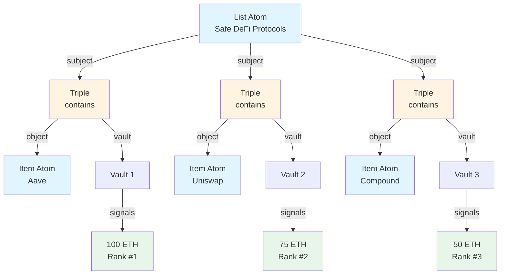

# Building Curated Lists with Community Ranking

Build a community-curated list where ranking is determined by stake. Perfect for token-curated registries (TCRs), trusted contract lists, or any ranked collection.

**Time to complete:** 2 hours
**Difficulty:** Intermediate
**Prerequisites:**
- SDK installed
- Wallet connected to Intuition Testnet
- Understanding of atoms and triples

## What We'll Build

A curated list system featuring:
- ✅ List creation (e.g., "Safe DeFi Protocols")
- ✅ Item submission to lists
- ✅ Stake-based ranking
- ✅ Challenge mechanism for disputed entries
- ✅ Automatic sorting by community confidence
- ✅ UI for browsing and curating

By the end, you'll have a working token-curated registry where the community stakes to vouch for list entries, creating a signal-based reputation system.

## Architecture Overview



**How It Works:**

1. **Lists** are atoms (e.g., "Top DeFi Protocols")
2. **Items** are atoms (e.g., "Aave", "Uniswap")
3. **Membership** is a triple: `[List] [contains] [Item]`
4. **Ranking** is determined by total stake in each triple's vault
5. **Curation** happens through signals (deposit = vouch, redeem = challenge)

## Part 1: Data Model Design

### Atoms We'll Create

**List Atoms:**
```typescript
{
  type: 'thing',
  value: 'Safe DeFi Protocols'
}
```

**Item Atoms:**
```typescript
// Option 1: Simple string
{
  type: 'thing',
  value: 'Aave'
}

// Option 2: Contract address
{
  type: 'account',
  value: '0x7Fc66500c84A76Ad7e9c93437bFc5Ac33E2DDaE9' // AAVE token
}

// Option 3: URL
{
  type: 'thing',
  value: 'https://aave.com'
}
```

### Triple Structure

Each list entry is a triple:
```
Subject: List ("Safe DeFi Protocols")
Predicate: "contains" or "includes"
Object: Item ("Aave")
```

The total signals on this triple = community confidence in this item being in the list.

## Part 2: Creating Lists

### Initialize SDK

```typescript
import { createMultivault, getAtomId } from '@0xintuition/sdk'

const multivault = createMultivault({
  privateKey: process.env.PRIVATE_KEY!,
  rpcUrl: 'https://sepolia.base.org',
  multivaultAddress: '0x...'
})
```

### Create a List Atom

```typescript
async function createList(listName: string, description?: string) {
  try {
    const atomData = {
      type: 'thing',
      value: listName
    }

    const result = await multivault.createAtom({
      atomUri: atomData
    })

    console.log(`List created: ${listName}`)
    console.log(`List ID: ${result.atomId}`)

    // Optionally store metadata off-chain
    if (description) {
      // Store in IPFS or database
      await storeListMetadata(result.atomId, {
        name: listName,
        description,
        creator: multivault.getWalletAddress(),
        createdAt: Date.now()
      })
    }

    return result.atomId
  } catch (error) {
    console.error('Error creating list:', error)
    throw error
  }
}

// Create example lists
const safeDefiList = await createList(
  'Safe DeFi Protocols',
  'Community-vetted DeFi protocols with strong security records'
)

const topNFTList = await createList(
  'Top NFT Collections',
  'Highest quality NFT projects'
)
```

### Create the "contains" Predicate

```typescript
async function createContainsPredicate() {
  const predicateData = {
    type: 'thing',
    value: 'contains'
  }

  const predicateId = getAtomId(predicateData)
  const exists = await multivault.atomExists(predicateId)

  if (!exists) {
    const result = await multivault.createAtom({
      atomUri: predicateData
    })
    return result.atomId
  }

  return predicateId
}

const containsPredicateId = await createContainsPredicate()
```

## Part 3: Adding Items to Lists

### Submit an Item

```typescript
async function submitToList(
  listAtomId: string,
  itemName: string,
  itemType: 'thing' | 'account' = 'thing',
  initialStake: bigint = BigInt(0)
) {
  try {
    // Create or get item atom
    const itemAtomId = getAtomId({
      type: itemType,
      value: itemName.toLowerCase()
    })

    const itemExists = await multivault.atomExists(itemAtomId)
    if (!itemExists) {
      await multivault.createAtom({
        atomUri: {
          type: itemType,
          value: itemName.toLowerCase()
        }
      })
    }

    // Create membership triple
    const result = await multivault.createTriple({
      subjectId: listAtomId,
      predicateId: containsPredicateId,
      objectId: itemAtomId
    })

    console.log(`Item submitted: ${itemName}`)
    console.log(`Triple ID: ${result.tripleId}`)

    // Optionally add initial stake
    if (initialStake > 0) {
      await multivault.depositTriple({
        id: result.tripleId,
        amount: initialStake,
        receiver: multivault.getWalletAddress()
      })
    }

    return result.tripleId
  } catch (error) {
    console.error('Error submitting item:', error)
    throw error
  }
}

// Submit DeFi protocols
await submitToList(safeDefiList, 'Aave', 'thing', BigInt('1000000000000000000')) // 1 ETH
await submitToList(safeDefiList, 'Uniswap', 'thing', BigInt('750000000000000000')) // 0.75 ETH
await submitToList(safeDefiList, 'Compound', 'thing', BigInt('500000000000000000')) // 0.5 ETH
```

### Batch Submit Items

```typescript
async function batchSubmitToList(
  listAtomId: string,
  items: Array<{ name: string; type: 'thing' | 'account'; stake: bigint }>
) {
  const results = []

  for (const item of items) {
    const tripleId = await submitToList(
      listAtomId,
      item.name,
      item.type,
      item.stake
    )
    results.push({ name: item.name, tripleId })
  }

  return results
}

// Add multiple items at once
await batchSubmitToList(topNFTList, [
  { name: 'CryptoPunks', type: 'thing', stake: BigInt('2000000000000000000') },
  { name: 'Bored Ape Yacht Club', type: 'thing', stake: BigInt('1500000000000000000') },
  { name: 'Azuki', type: 'thing', stake: BigInt('1000000000000000000') }
])
```

## Part 4: Curating with Signals

### Vouching for an Item (Deposit Signal)

```typescript
async function vouchForItem(tripleId: string, amount: bigint) {
  try {
    const result = await multivault.depositTriple({
      id: tripleId,
      amount: amount,
      receiver: multivault.getWalletAddress()
    })

    console.log(`Vouched with ${amount} wei`)
    console.log(`Transaction: ${result.transactionHash}`)

    return result
  } catch (error) {
    console.error('Error vouching:', error)
    throw error
  }
}

// Vouch for Aave with 0.5 ETH
await vouchForItem(aaveTripleId, BigInt('500000000000000000'))
```

### Challenging an Item (Redeem Signal)

```typescript
async function challengeItem(tripleId: string, amount: bigint, reason?: string) {
  try {
    const result = await multivault.redeemTriple({
      id: tripleId,
      amount: amount
    })

    console.log(`Challenged with ${amount} wei`)

    // Record challenge reason
    if (reason) {
      await storeChallengeReason(tripleId, {
        challenger: multivault.getWalletAddress(),
        amount: amount.toString(),
        reason,
        timestamp: Date.now()
      })
    }

    return result
  } catch (error) {
    console.error('Error challenging:', error)
    throw error
  }
}

// Challenge a suspicious entry
await challengeItem(
  suspiciousTripleId,
  BigInt('100000000000000000'),
  'This protocol has security vulnerabilities'
)
```

## Part 5: Ranking Algorithm

### Query List Items with Stakes

```typescript
import { request, gql } from 'graphql-request'

const GRAPHQL_ENDPOINT = 'https://api.intuition.systems/graphql'

const GET_LIST_ITEMS = gql`
  query GetListItems($listAtomId: String!) {
    triples(
      where: {
        subject: { id: $listAtomId }
        predicate: { value: "contains" }
      }
    ) {
      id
      object {
        id
        value
        type
      }
      vault {
        id
        totalShares
        currentSharePrice
        positionCount
      }
      signals(orderBy: delta, orderDirection: desc) {
        accountId
        delta
        direction
        timestamp
      }
    }
  }
`

async function getListItems(listAtomId: string) {
  const data = await request(GRAPHQL_ENDPOINT, GET_LIST_ITEMS, {
    listAtomId
  })

  return data.triples
}
```

### Calculate Ranking

```typescript
interface RankedItem {
  tripleId: string
  name: string
  rank: number
  totalStake: bigint
  vouchCount: number
  challengeCount: number
  confidence: number
  netSignal: bigint
}

function calculateRanking(items: any[]): RankedItem[] {
  const ranked = items.map(item => {
    const signals = item.signals || []

    // Separate vouch (for) and challenge (against) signals
    const vouches = signals.filter((s: any) => s.direction === 'for')
    const challenges = signals.filter((s: any) => s.direction === 'against')

    // Calculate total stake
    const totalVouches = vouches.reduce(
      (sum: bigint, s: any) => sum + BigInt(s.delta),
      BigInt(0)
    )
    const totalChallenges = challenges.reduce(
      (sum: bigint, s: any) => sum + BigInt(s.delta),
      BigInt(0)
    )

    // Net signal = vouches - challenges
    const netSignal = totalVouches - totalChallenges

    // Confidence score considers both amount and number of signals
    const stakeWeight = Math.log10(Number(netSignal) / 1e18 + 1)
    const participantWeight = Math.sqrt(vouches.length)
    const confidence = stakeWeight * participantWeight

    return {
      tripleId: item.id,
      name: item.object.value,
      rank: 0, // Will be set after sorting
      totalStake: totalVouches,
      vouchCount: vouches.length,
      challengeCount: challenges.length,
      confidence,
      netSignal
    }
  })

  // Sort by net signal (descending)
  ranked.sort((a, b) => {
    const diff = Number(b.netSignal - a.netSignal)
    if (diff !== 0) return diff
    // Tiebreaker: more participants = higher rank
    return b.vouchCount - a.vouchCount
  })

  // Assign ranks
  ranked.forEach((item, index) => {
    item.rank = index + 1
  })

  return ranked
}

// Usage
const items = await getListItems(safeDefiList)
const rankings = calculateRanking(items)

console.log('Ranked Items:')
rankings.forEach(item => {
  console.log(`#${item.rank} ${item.name}`)
  console.log(`  Stake: ${Number(item.totalStake) / 1e18} ETH`)
  console.log(`  Vouches: ${item.vouchCount}, Challenges: ${item.challengeCount}`)
  console.log(`  Confidence: ${item.confidence.toFixed(2)}`)
})
```

### Alternative: Time-Weighted Ranking

Give more weight to recent signals:

```typescript
function calculateTimeWeightedRanking(items: any[], decayRate: number = 0.95): RankedItem[] {
  const now = Date.now() / 1000

  const ranked = items.map(item => {
    const signals = item.signals || []

    let weightedVouches = BigInt(0)
    let weightedChallenges = BigInt(0)
    let vouchCount = 0
    let challengeCount = 0

    for (const signal of signals) {
      const age = now - signal.timestamp
      const daysPassed = age / (60 * 60 * 24)
      const decay = Math.pow(decayRate, daysPassed)

      const weightedDelta = BigInt(Math.floor(Number(signal.delta) * decay))

      if (signal.direction === 'for') {
        weightedVouches += weightedDelta
        vouchCount++
      } else {
        weightedChallenges += weightedDelta
        challengeCount++
      }
    }

    const netSignal = weightedVouches - weightedChallenges

    return {
      tripleId: item.id,
      name: item.object.value,
      rank: 0,
      totalStake: weightedVouches,
      vouchCount,
      challengeCount,
      confidence: Math.log10(Number(netSignal) / 1e18 + 1) * Math.sqrt(vouchCount),
      netSignal
    }
  })

  ranked.sort((a, b) => Number(b.netSignal - a.netSignal))
  ranked.forEach((item, index) => { item.rank = index + 1 })

  return ranked
}
```

## Part 6: Dispute Resolution

### Automatic Removal Threshold

Remove items that fall below a threshold:

```typescript
async function enforceMinimumStake(
  listAtomId: string,
  minimumStake: bigint
) {
  const items = await getListItems(listAtomId)
  const rankings = calculateRanking(items)

  const itemsToRemove = rankings.filter(item => item.netSignal < minimumStake)

  console.log(`Removing ${itemsToRemove.length} items below threshold`)

  for (const item of itemsToRemove) {
    // Note: Triples cannot be deleted, but we can flag them as removed
    await markItemAsRemoved(item.tripleId, 'Below minimum stake threshold')
  }

  return itemsToRemove
}
```

### Challenge Period

Implement a waiting period before acceptance:

```typescript
interface Submission {
  tripleId: string
  submittedAt: number
  challengePeriod: number
}

const CHALLENGE_PERIOD = 7 * 24 * 60 * 60 // 7 days in seconds

async function getSubmissionStatus(tripleId: string): Promise<'pending' | 'accepted' | 'rejected'> {
  const submission = await getSubmissionMetadata(tripleId)

  const now = Date.now() / 1000
  const elapsed = now - submission.submittedAt

  // Still in challenge period
  if (elapsed < submission.challengePeriod) {
    return 'pending'
  }

  // After challenge period, check net signal
  const item = await getTripleById(tripleId)
  const signals = item.signals || []

  const netSignal = signals.reduce((sum, s) => {
    const delta = BigInt(s.delta)
    return s.direction === 'for' ? sum + delta : sum - delta
  }, BigInt(0))

  // Positive net signal = accepted
  return netSignal > 0 ? 'accepted' : 'rejected'
}
```

## Part 7: UI Components

### List Display Component

```tsx
import React, { useEffect, useState } from 'react'

interface ListItem {
  rank: number
  name: string
  stake: string
  vouches: number
  challenges: number
}

export function CuratedList({ listAtomId }: { listAtomId: string }) {
  const [items, setItems] = useState<ListItem[]>([])
  const [loading, setLoading] = useState(true)

  useEffect(() => {
    async function loadList() {
      const rawItems = await getListItems(listAtomId)
      const rankings = calculateRanking(rawItems)

      const formatted = rankings.map(r => ({
        rank: r.rank,
        name: r.name,
        stake: (Number(r.totalStake) / 1e18).toFixed(2),
        vouches: r.vouchCount,
        challenges: r.challengeCount
      }))

      setItems(formatted)
      setLoading(false)
    }

    loadList()
  }, [listAtomId])

  if (loading) return <div>Loading list...</div>

  return (
    <div className="curated-list">
      <div className="list-items">
        {items.map(item => (
          <ListItemCard key={item.name} item={item} />
        ))}
      </div>
    </div>
  )
}

function ListItemCard({ item }: { item: ListItem }) {
  return (
    <div className="list-item-card">
      <div className="rank">#{item.rank}</div>
      <div className="item-info">
        <h3>{item.name}</h3>
        <div className="stats">
          <span className="stake">{item.stake} ETH staked</span>
          <span className="signals">
            {item.vouches} vouches, {item.challenges} challenges
          </span>
        </div>
      </div>
      <div className="actions">
        <button className="vouch-btn">Vouch</button>
        <button className="challenge-btn">Challenge</button>
      </div>
    </div>
  )
}
```

### Submit Item Form

```tsx
export function SubmitItemForm({ listAtomId }: { listAtomId: string }) {
  const [itemName, setItemName] = useState('')
  const [initialStake, setInitialStake] = useState('0.1')
  const [loading, setLoading] = useState(false)

  async function handleSubmit() {
    setLoading(true)
    try {
      const stakeWei = BigInt(parseFloat(initialStake) * 1e18)
      await submitToList(listAtomId, itemName, 'thing', stakeWei)
      alert(`${itemName} submitted!`)
      setItemName('')
    } catch (error) {
      alert('Error submitting item')
    } finally {
      setLoading(false)
    }
  }

  return (
    <div className="submit-form">
      <h3>Submit Item to List</h3>
      <input
        type="text"
        value={itemName}
        onChange={(e) => setItemName(e.target.value)}
        placeholder="Item name (e.g., Aave)"
      />
      <input
        type="number"
        step="0.01"
        value={initialStake}
        onChange={(e) => setInitialStake(e.target.value)}
        placeholder="Initial stake (ETH)"
      />
      <button onClick={handleSubmit} disabled={loading || !itemName}>
        {loading ? 'Submitting...' : 'Submit Item'}
      </button>
    </div>
  )
}
```

### Vouch/Challenge Component

```tsx
export function CurateItem({
  tripleId,
  itemName
}: {
  tripleId: string
  itemName: string
}) {
  const [amount, setAmount] = useState('0.1')
  const [action, setAction] = useState<'vouch' | 'challenge'>('vouch')
  const [loading, setLoading] = useState(false)

  async function handleCurate() {
    setLoading(true)
    try {
      const amountWei = BigInt(parseFloat(amount) * 1e18)

      if (action === 'vouch') {
        await vouchForItem(tripleId, amountWei)
        alert(`Vouched for ${itemName}!`)
      } else {
        await challengeItem(tripleId, amountWei)
        alert(`Challenged ${itemName}!`)
      }
    } catch (error) {
      alert('Error curating item')
    } finally {
      setLoading(false)
    }
  }

  return (
    <div className="curate-form">
      <h4>{itemName}</h4>

      <div className="action-toggle">
        <button
          className={action === 'vouch' ? 'active' : ''}
          onClick={() => setAction('vouch')}
        >
          Vouch
        </button>
        <button
          className={action === 'challenge' ? 'active' : ''}
          onClick={() => setAction('challenge')}
        >
          Challenge
        </button>
      </div>

      <input
        type="number"
        step="0.01"
        value={amount}
        onChange={(e) => setAmount(e.target.value)}
        placeholder="Amount (ETH)"
      />

      <button onClick={handleCurate} disabled={loading}>
        {loading
          ? 'Processing...'
          : `${action === 'vouch' ? 'Vouch' : 'Challenge'} with ${amount} ETH`}
      </button>
    </div>
  )
}
```

### List Browser

```tsx
export function ListBrowser() {
  const [lists, setLists] = useState<any[]>([])

  useEffect(() => {
    async function loadLists() {
      // Query all list atoms
      const query = gql`
        query GetLists {
          atoms(where: { type: "thing" }) {
            id
            value
            triples_as_subject {
              id
            }
          }
        }
      `

      const data = await request(GRAPHQL_ENDPOINT, query)

      // Filter for atoms that have triples (are lists)
      const listsWithItems = data.atoms.filter(
        (a: any) => a.triples_as_subject.length > 0
      )

      setLists(listsWithItems)
    }

    loadLists()
  }, [])

  return (
    <div className="list-browser">
      <h2>Browse Curated Lists</h2>
      <div className="lists-grid">
        {lists.map(list => (
          <div key={list.id} className="list-card">
            <h3>{list.value}</h3>
            <p>{list.triples_as_subject.length} items</p>
            <a href={`/list/${list.id}`}>View List →</a>
          </div>
        ))}
      </div>
    </div>
  )
}
```

## Part 8: Advanced Features

### Multi-List Membership

Items can be in multiple lists:

```typescript
async function addToMultipleLists(
  itemAtomId: string,
  listAtomIds: string[],
  stakes: bigint[]
) {
  const results = []

  for (let i = 0; i < listAtomIds.length; i++) {
    const result = await multivault.createTriple({
      subjectId: listAtomIds[i],
      predicateId: containsPredicateId,
      objectId: itemAtomId
    })

    if (stakes[i] > 0) {
      await multivault.depositTriple({
        id: result.tripleId,
        amount: stakes[i],
        receiver: multivault.getWalletAddress()
      })
    }

    results.push(result.tripleId)
  }

  return results
}
```

### Weighted Voting by Token Holdings

Give more weight to larger stakeholders:

```typescript
async function getVoterWeight(address: string): Promise<number> {
  // Check token balance (e.g., governance token)
  const balance = await getTokenBalance(address)

  // Convert to voting power (e.g., 1 token = 1x multiplier)
  return Math.sqrt(Number(balance) / 1e18)
}

function calculateWeightedRanking(items: any[]): RankedItem[] {
  const ranked = items.map(async item => {
    const signals = item.signals || []

    let weightedVouches = BigInt(0)

    for (const signal of signals.filter((s: any) => s.direction === 'for')) {
      const weight = await getVoterWeight(signal.accountId)
      const weightedDelta = BigInt(Math.floor(Number(signal.delta) * weight))
      weightedVouches += weightedDelta
    }

    return {
      tripleId: item.id,
      name: item.object.value,
      totalStake: weightedVouches,
      // ... other fields
    }
  })

  // Continue with sorting and ranking
  return Promise.all(ranked)
}
```

### List Forking

Allow users to fork lists and modify them:

```typescript
async function forkList(
  originalListAtomId: string,
  newListName: string
): Promise<string> {
  // Create new list
  const newListAtomId = await createList(newListName)

  // Get all items from original list
  const items = await getListItems(originalListAtomId)

  // Copy items to new list (without signals)
  for (const item of items) {
    await multivault.createTriple({
      subjectId: newListAtomId,
      predicateId: containsPredicateId,
      objectId: item.object.id
    })
  }

  console.log(`Forked list: ${newListName}`)
  return newListAtomId
}
```

## Complete Example

Here's a full implementation:

```typescript
import { createMultivault, getAtomId } from '@0xintuition/sdk'
import { request, gql } from 'graphql-request'

class CuratedListSystem {
  private multivault: any
  private containsPredicateId: string

  constructor(config: any) {
    this.multivault = createMultivault(config)
  }

  async initialize() {
    const predicateId = getAtomId({
      type: 'thing',
      value: 'contains'
    })

    const exists = await this.multivault.atomExists(predicateId)

    if (!exists) {
      const result = await this.multivault.createAtom({
        atomUri: {
          type: 'thing',
          value: 'contains'
        }
      })
      this.containsPredicateId = result.atomId
    } else {
      this.containsPredicateId = predicateId
    }
  }

  async createList(name: string) {
    const result = await this.multivault.createAtom({
      atomUri: {
        type: 'thing',
        value: name
      }
    })
    return result.atomId
  }

  async submitItem(listAtomId: string, itemName: string, stake: bigint) {
    const itemAtomId = getAtomId({
      type: 'thing',
      value: itemName
    })

    const exists = await this.multivault.atomExists(itemAtomId)
    if (!exists) {
      await this.multivault.createAtom({
        atomUri: {
          type: 'thing',
          value: itemName
        }
      })
    }

    const result = await this.multivault.createTriple({
      subjectId: listAtomId,
      predicateId: this.containsPredicateId,
      objectId: itemAtomId
    })

    if (stake > 0) {
      await this.multivault.depositTriple({
        id: result.tripleId,
        amount: stake,
        receiver: this.multivault.getWalletAddress()
      })
    }

    return result.tripleId
  }

  async vouchForItem(tripleId: string, amount: bigint) {
    return this.multivault.depositTriple({
      id: tripleId,
      amount,
      receiver: this.multivault.getWalletAddress()
    })
  }

  async getRankedList(listAtomId: string) {
    const items = await getListItems(listAtomId)
    return calculateRanking(items)
  }
}

// Usage
const system = new CuratedListSystem(config)
await system.initialize()

const listId = await system.createList('Top DeFi Protocols')
await system.submitItem(listId, 'Aave', BigInt('1000000000000000000'))
await system.submitItem(listId, 'Uniswap', BigInt('750000000000000000'))

const rankings = await system.getRankedList(listId)
console.log('Rankings:', rankings)
```

## Next Steps

You've built a complete curated list system! Explore:

1. **[Reputation System](/docs/tutorials/reputation-system)** - Combine with reputation
2. **[Fraud Detection](/docs/tutorials/fraud-detection)** - Use for safety lists
3. **[Nested Triples](/docs/tutorials/advanced/nested-triples)** - Advanced list logic

## Example Repository

```bash
git clone https://github.com/0xIntuition/curated-lists-example
cd curated-lists-example
npm install
npm run dev
```

## Resources

- [SDK Overview](/docs/intuition-sdk/quick-start)
- [GraphQL API](/docs/graphql-api/overview)
- [Community Discord](https://discord.gg/RgBenkX4mx)

---

Built with Intuition - The Universal Reputation Protocol
