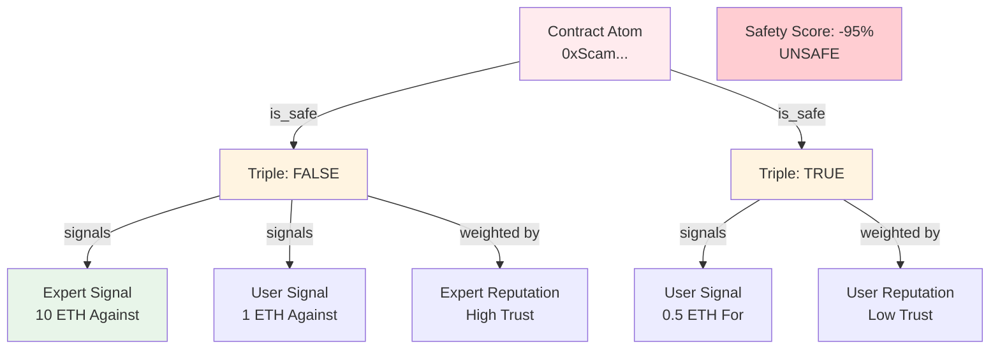

# Building a Fraud Detection System

Create a community-driven fraud detection system where users flag malicious contracts, scam tokens, and phishing sites, with expert signals weighted more heavily.

**Time to complete:** 2 hours
**Difficulty:** Advanced
**Prerequisites:**
- SDK installed
- Understanding of triples and signals
- GraphQL knowledge

## What We'll Build

A fraud detection platform featuring:
- ✅ Contract safety claims
- ✅ Scam flagging with evidence
- ✅ Expert-weighted voting
- ✅ Automatic alert system
- ✅ False positive dispute mechanism
- ✅ Safety score calculation

This creates a decentralized, community-curated database of known scams and safe contracts.

## Architecture Overview



**How It Works:**

1. **Contracts** are represented as atoms
2. **Safety claims** are triples: `[Contract] [is_safe] [TRUE/FALSE]`
3. **Signals** represent votes for/against safety
4. **Expert weighting** gives more influence to trusted reporters
5. **Safety scores** aggregate weighted signals

## Part 1: Data Model

### Atoms

**Contract Atoms:**
```typescript
{
  type: 'account',
  value: '0x...' // Contract address
}
```

**Boolean Atoms:**
```typescript
{
  type: 'thing',
  value: 'true'
}

{
  type: 'thing',
  value: 'false'
}
```

### Predicates

- `is_safe` - Safety claim predicate
- `is_scam` - Alternative scam flag
- `has_vulnerability` - Specific security issue

### Triple Examples

**Safe Contract:**
```
[0xUniswap...] [is_safe] [true]
```

**Unsafe Contract:**
```
[0xScamToken...] [is_safe] [false]
```

## Part 2: Setup and Initialization

### Initialize SDK

```typescript
import { createMultivault, getAtomId } from '@0xintuition/sdk'

const multivault = createMultivault({
  privateKey: process.env.PRIVATE_KEY!,
  rpcUrl: 'https://sepolia.base.org',
  multivaultAddress: '0x...'
})
```

### Create Boolean Atoms

```typescript
async function initializeBooleanAtoms() {
  const trueAtom = {
    type: 'thing',
    value: 'true'
  }

  const falseAtom = {
    type: 'thing',
    value: 'false'
  }

  // Create or get atoms
  const trueId = getAtomId(trueAtom)
  const falseId = getAtomId(falseAtom)

  const trueExists = await multivault.atomExists(trueId)
  const falseExists = await multivault.atomExists(falseId)

  if (!trueExists) {
    await multivault.createAtom({ atomUri: trueAtom })
  }

  if (!falseExists) {
    await multivault.createAtom({ atomUri: falseAtom })
  }

  return { trueId, falseId }
}

const { trueId, falseId } = await initializeBooleanAtoms()
```

### Create Predicates

```typescript
async function createSafetyPredicates() {
  const predicates = ['is_safe', 'is_scam', 'has_vulnerability']
  const predicateIds: Record<string, string> = {}

  for (const pred of predicates) {
    const atomData = {
      type: 'thing',
      value: pred
    }

    const predicateId = getAtomId(atomData)
    const exists = await multivault.atomExists(predicateId)

    if (!exists) {
      await multivault.createAtom({ atomUri: atomData })
    }

    predicateIds[pred] = predicateId
  }

  return predicateIds
}

const predicates = await createSafetyPredicates()
```

## Part 3: Flagging Contracts

### Flag as Unsafe

```typescript
interface FlagOptions {
  contractAddress: string
  reason: string
  evidence?: string[]
  category?: 'scam' | 'phishing' | 'rug_pull' | 'exploit'
  stake: bigint
}

async function flagContractAsUnsafe(options: FlagOptions) {
  try {
    // Create contract atom
    const contractAtomId = getAtomId({
      type: 'account',
      value: options.contractAddress.toLowerCase()
    })

    const exists = await multivault.atomExists(contractAtomId)
    if (!exists) {
      await multivault.createAtom({
        atomUri: {
          type: 'account',
          value: options.contractAddress.toLowerCase()
        }
      })
    }

    // Create safety claim: [Contract] [is_safe] [false]
    const result = await multivault.createTriple({
      subjectId: contractAtomId,
      predicateId: predicates.is_safe,
      objectId: falseId
    })

    // Signal on the triple
    await multivault.depositTriple({
      id: result.tripleId,
      amount: options.stake,
      receiver: multivault.getWalletAddress()
    })

    // Store metadata off-chain
    await storeFlagMetadata(result.tripleId, {
      reason: options.reason,
      evidence: options.evidence || [],
      category: options.category || 'scam',
      reporter: multivault.getWalletAddress(),
      timestamp: Date.now()
    })

    console.log('Contract flagged:', options.contractAddress)
    return result.tripleId
  } catch (error) {
    console.error('Error flagging contract:', error)
    throw error
  }
}

// Example: Flag a scam token
await flagContractAsUnsafe({
  contractAddress: '0x1234567890abcdef...',
  reason: 'Honeypot token - users cannot sell',
  evidence: [
    'https://etherscan.io/tx/0x...',
    'https://tokensniffer.com/token/0x...'
  ],
  category: 'scam',
  stake: BigInt('100000000000000000') // 0.1 ETH
})
```

### Mark as Safe

```typescript
async function markContractAsSafe(
  contractAddress: string,
  reason: string,
  stake: bigint
) {
  const contractAtomId = getAtomId({
    type: 'account',
    value: contractAddress.toLowerCase()
  })

  const exists = await multivault.atomExists(contractAtomId)
  if (!exists) {
    await multivault.createAtom({
      atomUri: {
        type: 'account',
        value: contractAddress.toLowerCase()
      }
    })
  }

  // Create safety claim: [Contract] [is_safe] [true]
  const result = await multivault.createTriple({
    subjectId: contractAtomId,
    predicateId: predicates.is_safe,
    objectId: trueId
  })

  await multivault.depositTriple({
    id: result.tripleId,
    amount: stake,
    receiver: multivault.getWalletAddress()
  })

  await storeFlagMetadata(result.tripleId, {
    reason,
    reporter: multivault.getWalletAddress(),
    timestamp: Date.now()
  })

  return result.tripleId
}

// Mark Uniswap as safe
await markContractAsSafe(
  '0x1f9840a85d5aF5bf1D1762F925BDADdC4201F984',
  'Official Uniswap token contract, audited and verified',
  BigInt('500000000000000000') // 0.5 ETH
)
```

## Part 4: Expert Reputation System

### Calculate Reporter Reputation

```typescript
async function getReporterReputation(address: string): Promise<number> {
  // Query all flags by this reporter
  const query = gql`
    query GetReporterHistory($address: String!) {
      signals(
        where: {
          accountId: $address
        }
      ) {
        triple {
          id
          subject {
            value
          }
          object {
            value
          }
        }
        delta
      }
    }
  `

  const data = await request(GRAPHQL_ENDPOINT, query, {
    address: address.toLowerCase()
  })

  // Calculate accuracy score
  let correct = 0
  let total = 0

  for (const signal of data.signals) {
    // Check if this flag was later verified by community
    const consensusReached = await checkConsensus(signal.triple.id)

    if (consensusReached) {
      total++
      if (signal.triple.object.value === consensusReached.value) {
        correct++
      }
    }
  }

  // Accuracy percentage
  const accuracy = total > 0 ? correct / total : 0.5

  // Reputation score: accuracy * log(total reports)
  const reputationScore = accuracy * Math.log10(total + 1)

  return Math.min(reputationScore, 1) // Cap at 1.0
}

// Get reputation
const expertScore = await getReporterReputation('0xExpert...')
console.log('Expert reputation:', expertScore) // e.g., 0.95
```

### Weight Signals by Reputation

```typescript
function calculateWeightedSignal(
  stake: bigint,
  reputation: number,
  minWeight: number = 0.1,
  maxWeight: number = 10
): bigint {
  // Weight = 0.1 to 10x based on reputation
  const weight = minWeight + (maxWeight - minWeight) * reputation

  return BigInt(Math.floor(Number(stake) * weight))
}

// Example
const normalUserStake = BigInt('100000000000000000') // 0.1 ETH
const expertStake = BigInt('100000000000000000') // 0.1 ETH

const normalWeight = calculateWeightedSignal(normalUserStake, 0.3) // Low rep
const expertWeight = calculateWeightedSignal(expertStake, 0.95) // High rep

console.log('Normal user weighted stake:', normalWeight)
// -> 0.13 ETH equivalent

console.log('Expert weighted stake:', expertWeight)
// -> 1.0 ETH equivalent (10x multiplier)
```

## Part 5: Safety Score Calculation

### Query Safety Claims

```typescript
import { request, gql } from 'graphql-request'

const GRAPHQL_ENDPOINT = 'https://api.intuition.systems/graphql'

const GET_SAFETY_CLAIMS = gql`
  query GetSafetyClaims($contractAddress: String!) {
    triples(
      where: {
        subject: { value: $contractAddress }
        predicate: { value: "is_safe" }
      }
    ) {
      id
      object {
        value
      }
      signals {
        accountId
        delta
        direction
      }
    }
  }
`

async function getSafetyClaims(contractAddress: string) {
  const data = await request(GRAPHQL_ENDPOINT, GET_SAFETY_CLAIMS, {
    contractAddress: contractAddress.toLowerCase()
  })

  return data.triples
}
```

### Calculate Safety Score

```typescript
interface SafetyScore {
  score: number // -100 to +100
  status: 'safe' | 'unsafe' | 'unknown'
  confidence: number // 0 to 1
  safeSignals: bigint
  unsafeSignals: bigint
  totalReporters: number
}

async function calculateSafetyScore(
  contractAddress: string
): Promise<SafetyScore> {
  const claims = await getSafetyClaims(contractAddress)

  if (claims.length === 0) {
    return {
      score: 0,
      status: 'unknown',
      confidence: 0,
      safeSignals: BigInt(0),
      unsafeSignals: BigInt(0),
      totalReporters: 0
    }
  }

  let weightedSafeSignals = BigInt(0)
  let weightedUnsafeSignals = BigInt(0)
  const reporters = new Set<string>()

  for (const claim of claims) {
    const isSafeClaim = claim.object.value === 'true'

    for (const signal of claim.signals) {
      if (signal.direction !== 'for') continue

      reporters.add(signal.accountId)

      // Get reporter reputation
      const reputation = await getReporterReputation(signal.accountId)

      // Weight the signal
      const weightedStake = calculateWeightedSignal(
        BigInt(signal.delta),
        reputation
      )

      if (isSafeClaim) {
        weightedSafeSignals += weightedStake
      } else {
        weightedUnsafeSignals += weightedStake
      }
    }
  }

  // Calculate net score (-100 to +100)
  const totalSignals = weightedSafeSignals + weightedUnsafeSignals
  const netSignals = weightedSafeSignals - weightedUnsafeSignals

  let score = 0
  if (totalSignals > 0) {
    score = Number((netSignals * BigInt(100)) / totalSignals)
  }

  // Confidence based on total stake and reporters
  const totalETH = Number(totalSignals) / 1e18
  const stakeConfidence = Math.min(totalETH / 10, 1) // Max at 10 ETH
  const reporterConfidence = Math.min(reporters.size / 20, 1) // Max at 20 reporters
  const confidence = (stakeConfidence + reporterConfidence) / 2

  // Determine status
  let status: 'safe' | 'unsafe' | 'unknown' = 'unknown'
  if (confidence > 0.5) {
    status = score > 30 ? 'safe' : score < -30 ? 'unsafe' : 'unknown'
  }

  return {
    score,
    status,
    confidence,
    safeSignals: weightedSafeSignals,
    unsafeSignals: weightedUnsafeSignals,
    totalReporters: reporters.size
  }
}

// Check contract safety
const safety = await calculateSafetyScore('0x1234...')
console.log('Safety Score:', safety.score)
console.log('Status:', safety.status)
console.log('Confidence:', safety.confidence)
```

## Part 6: Alert System

### Subscribe to New Flags

```typescript
async function subscribeToFlags(
  callback: (flag: any) => void,
  filters?: {
    category?: string[]
    minStake?: bigint
  }
) {
  // Poll for new flags (or use WebSocket if available)
  setInterval(async () => {
    const recentFlags = await getRecentFlags(60) // Last 60 seconds

    for (const flag of recentFlags) {
      // Apply filters
      if (filters?.category && !filters.category.includes(flag.category)) {
        continue
      }

      if (filters?.minStake && BigInt(flag.stake) < filters.minStake) {
        continue
      }

      callback(flag)
    }
  }, 5000) // Check every 5 seconds
}

// Usage
subscribeToFlags(
  (flag) => {
    console.log('New flag:', flag.contractAddress)
    console.log('Reason:', flag.reason)
    sendAlert(flag) // Send notification
  },
  {
    category: ['scam', 'rug_pull'],
    minStake: BigInt('50000000000000000') // 0.05 ETH minimum
  }
)
```

### Browser Extension Integration

```typescript
// For browser wallet integration
async function checkCurrentPage() {
  // Get current tab's contract interactions
  const contracts = await getPageContracts()

  for (const contract of contracts) {
    const safety = await calculateSafetyScore(contract)

    if (safety.status === 'unsafe' && safety.confidence > 0.7) {
      // Show warning
      showWarningBanner({
        contract,
        score: safety.score,
        reason: await getFlagReason(contract)
      })
    }
  }
}
```

## Part 7: Dispute Resolution

### Challenge a False Positive

```typescript
async function disputeFlag(
  tripleId: string,
  counterEvidence: string[],
  stake: bigint
) {
  try {
    // Signal against the flag (redeem/counter)
    await multivault.redeemTriple({
      id: tripleId,
      amount: stake
    })

    // Store dispute evidence
    await storeDisputeMetadata(tripleId, {
      disputer: multivault.getWalletAddress(),
      counterEvidence,
      stake: stake.toString(),
      timestamp: Date.now()
    })

    console.log('Flag disputed')
  } catch (error) {
    console.error('Error disputing flag:', error)
    throw error
  }
}

// Dispute a false flag
await disputeFlag(
  falsePositiveTripleId,
  [
    'Contract audit: https://...',
    'Team verification: https://...'
  ],
  BigInt('200000000000000000') // 0.2 ETH counter-stake
)
```

### Automatic Flag Removal

```typescript
async function removeOutdatedFlags(minimumConfidence: number = 0.3) {
  const allFlags = await getAllFlags()

  for (const flag of allFlags) {
    const safety = await calculateSafetyScore(flag.contractAddress)

    // If consensus flips or confidence drops, mark as outdated
    if (safety.confidence < minimumConfidence) {
      await markFlagAsOutdated(flag.tripleId)
    }
  }
}
```

## Part 8: UI Components

### Safety Badge Component

```tsx
import React, { useEffect, useState } from 'react'

export function SafetyBadge({ contractAddress }: { contractAddress: string }) {
  const [safety, setSafety] = useState<SafetyScore | null>(null)
  const [loading, setLoading] = useState(true)

  useEffect(() => {
    async function loadSafety() {
      const score = await calculateSafetyScore(contractAddress)
      setSafety(score)
      setLoading(false)
    }

    loadSafety()
  }, [contractAddress])

  if (loading) return <div>Checking safety...</div>

  if (!safety || safety.status === 'unknown') {
    return <div className="safety-badge unknown">No reports</div>
  }

  const getColor = () => {
    if (safety.status === 'safe') return 'green'
    if (safety.status === 'unsafe') return 'red'
    return 'gray'
  }

  return (
    <div className={`safety-badge ${safety.status}`}>
      <div className="badge-icon" style={{ background: getColor() }}>
        {safety.status === 'safe' ? '✓' : '⚠'}
      </div>
      <div className="badge-info">
        <div className="status">{safety.status.toUpperCase()}</div>
        <div className="score">Score: {safety.score}/100</div>
        <div className="confidence">
          Confidence: {(safety.confidence * 100).toFixed(0)}%
        </div>
        <div className="reporters">{safety.totalReporters} reporters</div>
      </div>
    </div>
  )
}
```

### Flag Contract Form

```tsx
export function FlagContractForm({ contractAddress }: { contractAddress: string }) {
  const [reason, setReason] = useState('')
  const [category, setCategory] = useState<'scam' | 'phishing' | 'rug_pull' | 'exploit'>('scam')
  const [stake, setStake] = useState('0.1')
  const [evidence, setEvidence] = useState<string[]>([])
  const [loading, setLoading] = useState(false)

  async function handleFlag() {
    setLoading(true)
    try {
      const stakeWei = BigInt(parseFloat(stake) * 1e18)

      await flagContractAsUnsafe({
        contractAddress,
        reason,
        category,
        evidence,
        stake: stakeWei
      })

      alert('Contract flagged successfully!')
    } catch (error) {
      alert('Error flagging contract')
    } finally {
      setLoading(false)
    }
  }

  return (
    <div className="flag-form">
      <h3>Report Unsafe Contract</h3>

      <select value={category} onChange={(e) => setCategory(e.target.value as any)}>
        <option value="scam">Scam</option>
        <option value="phishing">Phishing</option>
        <option value="rug_pull">Rug Pull</option>
        <option value="exploit">Exploit</option>
      </select>

      <textarea
        value={reason}
        onChange={(e) => setReason(e.target.value)}
        placeholder="Describe why this contract is unsafe..."
        rows={4}
      />

      <input
        type="number"
        step="0.01"
        value={stake}
        onChange={(e) => setStake(e.target.value)}
        placeholder="Stake amount (ETH)"
      />

      <button onClick={handleFlag} disabled={loading || !reason}>
        {loading ? 'Flagging...' : `Flag with ${stake} ETH`}
      </button>
    </div>
  )
}
```

### Safety Dashboard

```tsx
export function SafetyDashboard() {
  const [recentFlags, setRecentFlags] = useState<any[]>([])
  const [topReporters, setTopReporters] = useState<any[]>([])

  useEffect(() => {
    async function loadData() {
      const flags = await getRecentFlags(3600) // Last hour
      const reporters = await getTopReporters(10)

      setRecentFlags(flags)
      setTopReporters(reporters)
    }

    loadData()
  }, [])

  return (
    <div className="safety-dashboard">
      <section className="recent-flags">
        <h2>Recent Flags</h2>
        {recentFlags.map(flag => (
          <div key={flag.contractAddress} className="flag-card">
            <div className="contract">{flag.contractAddress}</div>
            <div className="category">{flag.category}</div>
            <div className="reason">{flag.reason}</div>
            <div className="reporter">By: {flag.reporter.slice(0, 8)}...</div>
          </div>
        ))}
      </section>

      <section className="top-reporters">
        <h2>Top Reporters</h2>
        <ol>
          {topReporters.map((reporter, i) => (
            <li key={reporter.address}>
              <span className="rank">#{i + 1}</span>
              <span className="address">{reporter.address}</span>
              <span className="score">{reporter.reputation.toFixed(2)}</span>
            </li>
          ))}
        </ol>
      </section>
    </div>
  )
}
```

## Complete Example

```typescript
class FraudDetectionSystem {
  private multivault: any
  private predicates: Map<string, string>
  private booleanAtoms: { trueId: string; falseId: string }

  constructor(config: any) {
    this.multivault = createMultivault(config)
    this.predicates = new Map()
  }

  async initialize() {
    this.booleanAtoms = await initializeBooleanAtoms()
    const predicateIds = await createSafetyPredicates()

    for (const [name, id] of Object.entries(predicateIds)) {
      this.predicates.set(name, id)
    }
  }

  async flagAsUnsafe(options: FlagOptions) {
    return flagContractAsUnsafe(options)
  }

  async checkSafety(contractAddress: string) {
    return calculateSafetyScore(contractAddress)
  }

  async getReporterTrust(address: string) {
    return getReporterReputation(address)
  }
}

// Usage
const system = new FraudDetectionSystem(config)
await system.initialize()

// Flag a scam
await system.flagAsUnsafe({
  contractAddress: '0xScam...',
  reason: 'Honeypot detected',
  category: 'scam',
  stake: BigInt('1e17')
})

// Check safety
const safety = await system.checkSafety('0xSomeContract...')
console.log('Safety:', safety.status)
```

## Next Steps

Explore more:

1. **[Curated Lists](/docs/guides/tutorials/curated-lists)** - Trusted contract registries
2. **[Reputation System](/docs/guides/tutorials/reputation-system)** - Expert reputation
3. **[Oracle Integration](/docs/guides/tutorials/advanced/oracle-integration)** - Use in smart contracts

## Example Repository

```bash
git clone https://github.com/0xIntuition/fraud-detection-example
```

## Resources

- [SDK Documentation](/docs/guides/developer-tools/sdk/getting-started)
- [GraphQL API](/docs/guides/developer-tools/graphql-api/overview)
- [Discord Community](https://discord.gg/RgBenkX4mx)

---

Built with Intuition - The Universal Reputation Protocol
