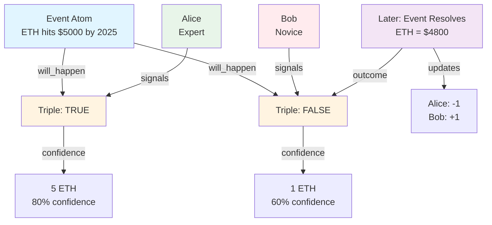

# Building a Non-Resolving Prediction Market

Create a prediction market where forecasts don't need formal resolution. Instead, track record and reputation emerge from the accuracy of past predictions.

**Time to complete:** 2 hours
**Difficulty:** Advanced
**Prerequisites:**
- SDK installed
- Understanding of signals and triples
- GraphQL knowledge

## What We'll Build

A prediction platform featuring:
- ✅ Event atoms (future events to predict)
- ✅ Prediction triples with confidence levels
- ✅ Track record calculation based on accuracy
- ✅ Forecaster reputation scores
- ✅ Confidence-weighted predictions
- ✅ Historical accuracy metrics

Unlike traditional prediction markets, this doesn't require formal resolution oracles. Community consensus emerges naturally.

## Architecture Overview



**How It Works:**

1. **Events** are atoms representing future states
2. **Predictions** are triples: `[Event] [will_happen] [TRUE/FALSE]`
3. **Confidence** is expressed via signal strength
4. **Resolution** happens through community consensus
5. **Track records** are calculated from past accuracy

## Part 1: Data Model

### Atoms

**Event Atoms:**
```typescript
{
  type: 'thing',
  value: 'ETH will reach $5000 by end of 2025'
}
```

**Outcome Atoms:**
```typescript
{
  type: 'thing',
  value: 'true'
}

{
  type: 'thing',
  value: 'false'
}
```

### Predicates

- `will_happen` - Binary prediction
- `probability` - Numeric probability (0-100)
- `resolved_as` - Final outcome

### Triple Examples

**Prediction:**
```
[ETH $5000 Event] [will_happen] [true]
```

**Resolution:**
```
[ETH $5000 Event] [resolved_as] [false]
```

## Part 2: Creating Events

### Initialize SDK

```typescript
import { createMultivault, getAtomId } from '@0xintuition/sdk'

const multivault = createMultivault({
  privateKey: process.env.PRIVATE_KEY!,
  rpcUrl: 'https://sepolia.base.org',
  multivaultAddress: '0x...'
})
```

### Create Boolean Atoms

```typescript
async function initializeBooleans() {
  const trueAtom = { type: 'thing', value: 'true' }
  const falseAtom = { type: 'thing', value: 'false' }

  const trueId = getAtomId(trueAtom)
  const falseId = getAtomId(falseAtom)

  for (const { atom, id } of [
    { atom: trueAtom, id: trueId },
    { atom: falseAtom, id: falseId }
  ]) {
    const exists = await multivault.atomExists(id)
    if (!exists) {
      await multivault.createAtom({ atomUri: atom })
    }
  }

  return { trueId, falseId }
}

const { trueId, falseId } = await initializeBooleans()
```

### Create an Event

```typescript
interface EventOptions {
  description: string
  category?: string
  resolutionDate?: number
  source?: string
}

async function createEvent(options: EventOptions) {
  try {
    const atomData = {
      type: 'thing',
      value: options.description
    }

    const result = await multivault.createAtom({
      atomUri: atomData
    })

    // Store metadata off-chain
    await storeEventMetadata(result.atomId, {
      description: options.description,
      category: options.category || 'general',
      resolutionDate: options.resolutionDate,
      source: options.source,
      creator: multivault.getWalletAddress(),
      createdAt: Date.now()
    })

    console.log('Event created:', result.atomId)
    return result.atomId
  } catch (error) {
    console.error('Error creating event:', error)
    throw error
  }
}

// Create example events
const ethEvent = await createEvent({
  description: 'ETH will reach $5000 by end of 2025',
  category: 'crypto',
  resolutionDate: new Date('2025-12-31').getTime()
})

const electionEvent = await createEvent({
  description: 'Candidate X will win 2024 election',
  category: 'politics',
  resolutionDate: new Date('2024-11-05').getTime()
})
```

### Create Predicates

```typescript
async function createPredictionPredicates() {
  const predicates = ['will_happen', 'resolved_as', 'probability']
  const predicateIds: Record<string, string> = {}

  for (const pred of predicates) {
    const atomData = {
      type: 'thing',
      value: pred
    }

    const predicateId = getAtomId(atomData)
    const exists = await multivault.atomExists(predicateId)

    if (!exists) {
      await multivault.createAtom({ atomUri: atomData })
    }

    predicateIds[pred] = predicateId
  }

  return predicateIds
}

const predicates = await createPredictionPredicates()
```

## Part 3: Making Predictions

### Submit a Prediction

```typescript
interface PredictionOptions {
  eventAtomId: string
  outcome: boolean
  confidence: number // 0-100
  stake: bigint
  reasoning?: string
}

async function submitPrediction(options: PredictionOptions) {
  try {
    // Create prediction triple: [Event] [will_happen] [true/false]
    const outcomeAtomId = options.outcome ? trueId : falseId

    const result = await multivault.createTriple({
      subjectId: options.eventAtomId,
      predicateId: predicates.will_happen,
      objectId: outcomeAtomId
    })

    // Signal with stake (stake represents confidence)
    await multivault.depositTriple({
      id: result.tripleId,
      amount: options.stake,
      receiver: multivault.getWalletAddress()
    })

    // Store prediction metadata
    await storePredictionMetadata(result.tripleId, {
      forecaster: multivault.getWalletAddress(),
      confidence: options.confidence,
      reasoning: options.reasoning,
      timestamp: Date.now()
    })

    console.log('Prediction submitted:', result.tripleId)
    return result.tripleId
  } catch (error) {
    console.error('Error submitting prediction:', error)
    throw error
  }
}

// Alice predicts ETH will reach $5000
await submitPrediction({
  eventAtomId: ethEvent,
  outcome: true,
  confidence: 75,
  stake: BigInt('500000000000000000'), // 0.5 ETH
  reasoning: 'ETF inflows and halvening cycle support this target'
})

// Bob predicts it won't
await submitPrediction({
  eventAtomId: ethEvent,
  outcome: false,
  confidence: 60,
  stake: BigInt('200000000000000000'), // 0.2 ETH
  reasoning: 'Regulatory headwinds and macroeconomic conditions'
})
```

### Update Prediction Confidence

```typescript
async function updatePredictionStake(
  tripleId: string,
  additionalStake: bigint
) {
  // Add more stake to increase confidence
  return multivault.depositTriple({
    id: tripleId,
    amount: additionalStake,
    receiver: multivault.getWalletAddress()
  })
}

// Alice increases her confidence
await updatePredictionStake(
  alicePredictionId,
  BigInt('250000000000000000') // +0.25 ETH
)
```

## Part 4: Querying Predictions

### Get All Predictions for an Event

```typescript
import { request, gql } from 'graphql-request'

const GRAPHQL_ENDPOINT = 'https://api.intuition.systems/graphql'

const GET_EVENT_PREDICTIONS = gql`
  query GetEventPredictions($eventAtomId: String!) {
    triples(
      where: {
        subject: { id: $eventAtomId }
        predicate: { value: "will_happen" }
      }
    ) {
      id
      object {
        value
      }
      signals {
        accountId
        delta
        timestamp
      }
    }
  }
`

async function getEventPredictions(eventAtomId: string) {
  const data = await request(GRAPHQL_ENDPOINT, GET_EVENT_PREDICTIONS, {
    eventAtomId
  })

  return data.triples
}
```

### Calculate Market Consensus

```typescript
interface MarketConsensus {
  probabilityTrue: number // 0-100
  totalStake: bigint
  forecasterCount: number
  predictions: Array<{
    forecaster: string
    outcome: boolean
    stake: bigint
    confidence: number
  }>
}

async function calculateConsensus(eventAtomId: string): Promise<MarketConsensus> {
  const predictions = await getEventPredictions(eventAtomId)

  let totalStakeTrue = BigInt(0)
  let totalStakeFalse = BigInt(0)
  const forecasters = new Set<string>()
  const predictionList: any[] = []

  for (const pred of predictions) {
    const isTrue = pred.object.value === 'true'

    for (const signal of pred.signals) {
      forecasters.add(signal.accountId)

      const stake = BigInt(signal.delta)

      if (isTrue) {
        totalStakeTrue += stake
      } else {
        totalStakeFalse += stake
      }

      // Get metadata for confidence
      const metadata = await getPredictionMetadata(pred.id)

      predictionList.push({
        forecaster: signal.accountId,
        outcome: isTrue,
        stake,
        confidence: metadata?.confidence || 50
      })
    }
  }

  const totalStake = totalStakeTrue + totalStakeFalse

  // Probability based on stake distribution
  let probabilityTrue = 50
  if (totalStake > 0) {
    probabilityTrue = Number((totalStakeTrue * BigInt(100)) / totalStake)
  }

  return {
    probabilityTrue,
    totalStake,
    forecasterCount: forecasters.size,
    predictions: predictionList
  }
}

// Get consensus
const consensus = await calculateConsensus(ethEvent)
console.log('Market probability:', consensus.probabilityTrue + '%')
console.log('Total stake:', Number(consensus.totalStake) / 1e18 + ' ETH')
```

## Part 5: Event Resolution

### Community Resolution

```typescript
async function resolveEvent(
  eventAtomId: string,
  outcome: boolean,
  evidence: string[]
) {
  try {
    // Create resolution triple: [Event] [resolved_as] [true/false]
    const outcomeAtomId = outcome ? trueId : falseId

    const resolvedAsPredicate = predicates.resolved_as

    const result = await multivault.createTriple({
      subjectId: eventAtomId,
      predicateId: resolvedAsPredicate,
      objectId: outcomeAtomId
    })

    // Store resolution metadata
    await storeResolutionMetadata(result.tripleId, {
      resolver: multivault.getWalletAddress(),
      outcome,
      evidence,
      resolvedAt: Date.now()
    })

    console.log('Event resolved:', outcome)
    return result.tripleId
  } catch (error) {
    console.error('Error resolving event:', error)
    throw error
  }
}

// After event concludes
await resolveEvent(
  ethEvent,
  false, // ETH did not reach $5000
  [
    'https://coinmarketcap.com/currencies/ethereum/',
    'Price on Dec 31, 2025: $4,800'
  ]
)
```

### Verify Resolution

Multiple users can signal agreement:

```typescript
async function confirmResolution(resolutionTripleId: string, stake: bigint) {
  return multivault.depositTriple({
    id: resolutionTripleId,
    amount: stake,
    receiver: multivault.getWalletAddress()
  })
}

// Others verify the resolution
await confirmResolution(resolutionTripleId, BigInt('100000000000000000'))
```

## Part 6: Track Record Calculation

### Calculate Forecaster Accuracy

```typescript
interface TrackRecord {
  totalPredictions: number
  correctPredictions: number
  accuracy: number
  averageConfidence: number
  brierScore: number
  calibration: number
}

async function calculateTrackRecord(
  forecasterAddress: string
): Promise<TrackRecord> {
  // Get all predictions by this forecaster
  const query = gql`
    query GetForecasterPredictions($address: String!) {
      signals(
        where: {
          accountId: $address
        }
      ) {
        triple {
          id
          subject {
            id
            value
          }
          object {
            value
          }
          predicate {
            value
          }
        }
        delta
      }
    }
  `

  const data = await request(GRAPHQL_ENDPOINT, query, {
    address: forecasterAddress.toLowerCase()
  })

  // Filter only prediction signals
  const predictions = data.signals.filter(
    (s: any) => s.triple.predicate.value === 'will_happen'
  )

  let correct = 0
  let total = 0
  let totalConfidence = 0
  let brierScoreSum = 0

  for (const pred of predictions) {
    // Check if event is resolved
    const eventAtomId = pred.triple.subject.id
    const resolution = await getEventResolution(eventAtomId)

    if (!resolution) continue // Event not resolved yet

    total++

    const predictedOutcome = pred.triple.object.value === 'true'
    const actualOutcome = resolution.outcome

    // Check if correct
    if (predictedOutcome === actualOutcome) {
      correct++
    }

    // Get prediction metadata
    const metadata = await getPredictionMetadata(pred.triple.id)
    const confidence = metadata?.confidence || 50

    totalConfidence += confidence

    // Brier score: (forecast - outcome)^2
    // Convert confidence to probability (0-1)
    const forecast = confidence / 100
    const outcome = actualOutcome ? 1 : 0
    brierScoreSum += Math.pow(forecast - outcome, 2)
  }

  const accuracy = total > 0 ? correct / total : 0
  const averageConfidence = total > 0 ? totalConfidence / total : 0
  const brierScore = total > 0 ? brierScoreSum / total : 0

  // Calibration: how well confidence matches accuracy
  const calibration = 1 - Math.abs((averageConfidence / 100) - accuracy)

  return {
    totalPredictions: total,
    correctPredictions: correct,
    accuracy,
    averageConfidence,
    brierScore,
    calibration
  }
}

// Get track record
const aliceRecord = await calculateTrackRecord('0xAlice...')
console.log('Accuracy:', (aliceRecord.accuracy * 100).toFixed(1) + '%')
console.log('Brier Score:', aliceRecord.brierScore.toFixed(3))
console.log('Calibration:', (aliceRecord.calibration * 100).toFixed(1) + '%')
```

### Leaderboard

```typescript
async function getTopForecasters(limit: number = 10) {
  // Get all unique forecasters
  const forecasters = await getAllForecasters()

  // Calculate track records
  const records = await Promise.all(
    forecasters.map(async (address) => ({
      address,
      record: await calculateTrackRecord(address)
    }))
  )

  // Filter to those with at least 10 predictions
  const qualified = records.filter(r => r.record.totalPredictions >= 10)

  // Sort by Brier score (lower is better)
  qualified.sort((a, b) => a.record.brierScore - b.record.brierScore)

  return qualified.slice(0, limit)
}

const leaderboard = await getTopForecasters()
leaderboard.forEach((entry, i) => {
  console.log(`#${i + 1} ${entry.address}`)
  console.log(`  Accuracy: ${(entry.record.accuracy * 100).toFixed(1)}%`)
  console.log(`  Brier: ${entry.record.brierScore.toFixed(3)}`)
})
```

## Part 7: UI Components

### Event Card Component

```tsx
import React, { useEffect, useState } from 'react'

export function EventCard({ eventAtomId }: { eventAtomId: string }) {
  const [event, setEvent] = useState<any>(null)
  const [consensus, setConsensus] = useState<MarketConsensus | null>(null)
  const [loading, setLoading] = useState(true)

  useEffect(() => {
    async function loadEvent() {
      const metadata = await getEventMetadata(eventAtomId)
      const marketConsensus = await calculateConsensus(eventAtomId)

      setEvent(metadata)
      setConsensus(marketConsensus)
      setLoading(false)
    }

    loadEvent()
  }, [eventAtomId])

  if (loading) return <div>Loading event...</div>

  return (
    <div className="event-card">
      <div className="event-header">
        <h3>{event.description}</h3>
        <span className="category">{event.category}</span>
      </div>

      <div className="consensus">
        <div className="probability-bar">
          <div
            className="probability-fill"
            style={{ width: `${consensus?.probabilityTrue}%` }}
          />
        </div>
        <div className="probability-label">
          {consensus?.probabilityTrue.toFixed(1)}% chance
        </div>
      </div>

      <div className="stats">
        <span>{consensus?.forecasterCount} forecasters</span>
        <span>{(Number(consensus?.totalStake) / 1e18).toFixed(2)} ETH staked</span>
      </div>

      <button className="predict-btn">Make Prediction</button>
    </div>
  )
}
```

### Prediction Form

```tsx
export function PredictionForm({ eventAtomId }: { eventAtomId: string }) {
  const [outcome, setOutcome] = useState<boolean>(true)
  const [confidence, setConfidence] = useState(50)
  const [stake, setStake] = useState('0.1')
  const [reasoning, setReasoning] = useState('')
  const [loading, setLoading] = useState(false)

  async function handleSubmit() {
    setLoading(true)
    try {
      const stakeWei = BigInt(parseFloat(stake) * 1e18)

      await submitPrediction({
        eventAtomId,
        outcome,
        confidence,
        stake: stakeWei,
        reasoning
      })

      alert('Prediction submitted!')
    } catch (error) {
      alert('Error submitting prediction')
    } finally {
      setLoading(false)
    }
  }

  return (
    <div className="prediction-form">
      <h3>Make Your Prediction</h3>

      <div className="outcome-toggle">
        <button
          className={outcome ? 'active' : ''}
          onClick={() => setOutcome(true)}
        >
          Will Happen
        </button>
        <button
          className={!outcome ? 'active' : ''}
          onClick={() => setOutcome(false)}
        >
          Won't Happen
        </button>
      </div>

      <div className="confidence-slider">
        <label>Confidence: {confidence}%</label>
        <input
          type="range"
          min="0"
          max="100"
          value={confidence}
          onChange={(e) => setConfidence(parseInt(e.target.value))}
        />
      </div>

      <input
        type="number"
        step="0.01"
        value={stake}
        onChange={(e) => setStake(e.target.value)}
        placeholder="Stake (ETH)"
      />

      <textarea
        value={reasoning}
        onChange={(e) => setReasoning(e.target.value)}
        placeholder="Explain your reasoning..."
        rows={4}
      />

      <button onClick={handleSubmit} disabled={loading}>
        {loading ? 'Submitting...' : `Predict with ${stake} ETH`}
      </button>
    </div>
  )
}
```

### Forecaster Profile

```tsx
export function ForecasterProfile({ address }: { address: string }) {
  const [trackRecord, setTrackRecord] = useState<TrackRecord | null>(null)
  const [loading, setLoading] = useState(true)

  useEffect(() => {
    async function loadTrackRecord() {
      const record = await calculateTrackRecord(address)
      setTrackRecord(record)
      setLoading(false)
    }

    loadTrackRecord()
  }, [address])

  if (loading) return <div>Loading track record...</div>

  return (
    <div className="forecaster-profile">
      <h2>Forecaster: {address.slice(0, 8)}...</h2>

      <div className="metrics">
        <div className="metric">
          <label>Accuracy</label>
          <value>{(trackRecord!.accuracy * 100).toFixed(1)}%</value>
        </div>

        <div className="metric">
          <label>Brier Score</label>
          <value>{trackRecord!.brierScore.toFixed(3)}</value>
        </div>

        <div className="metric">
          <label>Predictions</label>
          <value>
            {trackRecord!.correctPredictions} / {trackRecord!.totalPredictions}
          </value>
        </div>

        <div className="metric">
          <label>Calibration</label>
          <value>{(trackRecord!.calibration * 100).toFixed(1)}%</value>
        </div>
      </div>
    </div>
  )
}
```

### Leaderboard Component

```tsx
export function Leaderboard() {
  const [topForecasters, setTopForecasters] = useState<any[]>([])

  useEffect(() => {
    async function loadLeaderboard() {
      const top = await getTopForecasters(20)
      setTopForecasters(top)
    }

    loadLeaderboard()
  }, [])

  return (
    <div className="leaderboard">
      <h2>Top Forecasters</h2>
      <table>
        <thead>
          <tr>
            <th>Rank</th>
            <th>Address</th>
            <th>Accuracy</th>
            <th>Brier Score</th>
            <th>Predictions</th>
          </tr>
        </thead>
        <tbody>
          {topForecasters.map((forecaster, i) => (
            <tr key={forecaster.address}>
              <td>#{i + 1}</td>
              <td>{forecaster.address.slice(0, 10)}...</td>
              <td>{(forecaster.record.accuracy * 100).toFixed(1)}%</td>
              <td>{forecaster.record.brierScore.toFixed(3)}</td>
              <td>{forecaster.record.totalPredictions}</td>
            </tr>
          ))}
        </tbody>
      </table>
    </div>
  )
}
```

## Part 8: Advanced Features

### Time-Based Confidence Decay

```typescript
function calculateDecayedConfidence(
  originalStake: bigint,
  predictionTime: number,
  resolutionDate: number
): bigint {
  const now = Date.now()
  const timeUntilResolution = resolutionDate - predictionTime
  const timeSincePrediction = now - predictionTime

  // Decay factor: predictions closer to resolution are less valuable
  const timeRatio = timeSincePrediction / timeUntilResolution
  const decayFactor = 1 - (timeRatio * 0.5) // Max 50% decay

  return BigInt(Math.floor(Number(originalStake) * decayFactor))
}
```

### Conditional Predictions

```typescript
async function createConditionalPrediction(
  conditionEventId: string,
  consequentEventId: string,
  stake: bigint
) {
  // Create a nested triple:
  // "If [Condition] then [Consequent]"

  // First create the condition prediction
  const conditionTriple = await multivault.createTriple({
    subjectId: conditionEventId,
    predicateId: predicates.will_happen,
    objectId: trueId
  })

  // Create atom from this triple
  const conditionalAtomId = await multivault.createAtom({
    atomUri: {
      type: 'triple',
      value: conditionTriple.tripleId
    }
  })

  // Create implication triple
  const implicationPredicate = await getOrCreatePredicate('implies')

  const result = await multivault.createTriple({
    subjectId: conditionalAtomId,
    predicateId: implicationPredicate,
    objectId: consequentEventId
  })

  // Stake on the conditional
  await multivault.depositTriple({
    id: result.tripleId,
    amount: stake,
    receiver: multivault.getWalletAddress()
  })

  return result.tripleId
}
```

## Complete Example

```typescript
class PredictionMarket {
  private multivault: any
  private predicates: Map<string, string>
  private booleans: { trueId: string; falseId: string }

  constructor(config: any) {
    this.multivault = createMultivault(config)
    this.predicates = new Map()
  }

  async initialize() {
    this.booleans = await initializeBooleans()
    const predicateIds = await createPredictionPredicates()

    for (const [name, id] of Object.entries(predicateIds)) {
      this.predicates.set(name, id)
    }
  }

  async createEvent(options: EventOptions) {
    return createEvent(options)
  }

  async predict(options: PredictionOptions) {
    return submitPrediction(options)
  }

  async resolveEvent(eventAtomId: string, outcome: boolean, evidence: string[]) {
    return resolveEvent(eventAtomId, outcome, evidence)
  }

  async getConsensus(eventAtomId: string) {
    return calculateConsensus(eventAtomId)
  }

  async getTrackRecord(address: string) {
    return calculateTrackRecord(address)
  }
}

// Usage
const market = new PredictionMarket(config)
await market.initialize()

// Create event
const eventId = await market.createEvent({
  description: 'Bitcoin will reach $100k by end of 2025',
  category: 'crypto',
  resolutionDate: new Date('2025-12-31').getTime()
})

// Make prediction
await market.predict({
  eventAtomId: eventId,
  outcome: true,
  confidence: 80,
  stake: BigInt('1e18'),
  reasoning: 'Institutional adoption and ETF inflows'
})

// Later: resolve
await market.resolveEvent(eventId, true, ['https://coinmarketcap.com/...'])

// Check track record
const record = await market.getTrackRecord('0xForecaster...')
console.log('Accuracy:', record.accuracy)
```

## Next Steps

Explore more:

1. **[Reputation System](/docs/docs/tutorials/reputation-system)** - Track forecaster expertise
2. **[Curated Lists](/docs/docs/tutorials/curated-lists)** - Top forecasters
3. **[Fraud Detection](/docs/docs/tutorials/fraud-detection)** - Verify event outcomes

## Example Repository

```bash
git clone https://github.com/0xIntuition/prediction-market-example
```

## Resources

- [SDK Documentation](/docs/docs/intuition-sdk/getting-started)
- [GraphQL API](/docs/docs/graphql-api/overview)
- [Discord Community](https://discord.gg/RgBenkX4mx)

---

Built with Intuition - The Universal Reputation Protocol
