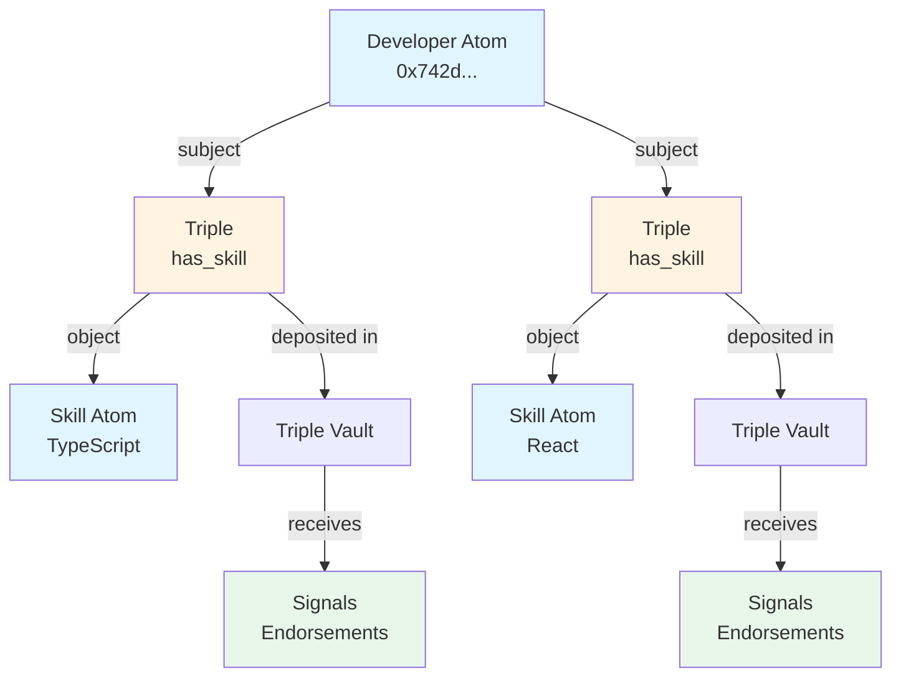

# Building a Reputation System

Learn how to build a complete reputation system using Intuition's primitives. We'll create a developer reputation platform where users can claim skills, receive endorsements, and build verifiable credentials.

**Time to complete:** 2-3 hours
**Difficulty:** Intermediate
**Prerequisites:**
- SDK installed
- Wallet connected to Intuition Testnet
- Basic TypeScript/React knowledge

## What We'll Build

A developer reputation platform with:
- ✅ Developer profile atoms (from Ethereum addresses)
- ✅ Skill atoms (TypeScript, React, Solidity, etc.)
- ✅ Skill attestation triples ([Developer] [has skill] [TypeScript])
- ✅ Endorsement signals (stake-weighted support)
- ✅ Reputation scoring based on signal strength
- ✅ React components for displaying reputation

By the end, you'll have a working system where developers can claim skills and the community can endorse those claims with stake, creating a verifiable, on-chain reputation.

## Architecture Overview



**Key Components:**

1. **Atoms** - Represent developers and skills
2. **Triples** - Express "Developer has Skill" relationships
3. **Vaults** - Hold staked assets for each atom and triple
4. **Signals** - Community endorsements via stake

## Part 1: Data Model Design

Before writing code, let's design our data model.

### Atoms We'll Create

**Developer Atoms:**
- Created from Ethereum addresses
- Example: `0x742d35Cc6634C0532925a3b844Bc9e7595f0bEb`

**Skill Atoms:**
- String-based identifiers
- Examples: "TypeScript", "React", "Solidity", "Rust"

### Triples We'll Create

Each skill claim is a triple:
```
Subject: Developer (0x742d...)
Predicate: "has_skill"
Object: Skill ("TypeScript")
```

### Signals We'll Track

Endorsements are signals on triples:
- **Position:** For (supporting the claim)
- **Amount:** Stake deposited
- **Creator:** Who endorsed

## Part 2: Creating Developer Profiles

Let's start by creating atoms for developers. Each developer is represented by their Ethereum address.

### Setup

First, initialize the SDK:

```typescript
import { createMultivault } from '@0xintuition/sdk'

const config = {
  privateKey: process.env.PRIVATE_KEY!,
  rpcUrl: 'https://sepolia.base.org',
  multivaultAddress: '0x...' // Intuition Multivault on Base Sepolia
}

const multivault = createMultivault(config)
```

### Creating a Developer Atom

```typescript
async function createDeveloperProfile(address: string) {
  try {
    // Create atom from Ethereum address
    const atomData = {
      type: 'account',
      value: address.toLowerCase()
    }

    const result = await multivault.createAtom({
      atomUri: atomData
    })

    console.log(`Developer atom created!`)
    console.log(`Atom ID: ${result.atomId}`)
    console.log(`Vault ID: ${result.vaultId}`)
    console.log(`Transaction: ${result.transactionHash}`)

    return result.atomId
  } catch (error) {
    console.error('Error creating developer profile:', error)
    throw error
  }
}

// Create profile for yourself
const myProfile = await createDeveloperProfile('0x742d35Cc6634C0532925a3b844Bc9e7595f0bEb')
```

**What's Happening:**
1. We create an atom with type `account` and the Ethereum address as value
2. The SDK handles the transaction to the Multivault contract
3. An atom ID and vault ID are returned
4. A vault is automatically created for this atom

### Checking if Profile Exists

Before creating, check if the atom already exists:

```typescript
import { getAtomId } from '@0xintuition/sdk'

async function getOrCreateDeveloperProfile(address: string) {
  // Generate deterministic atom ID
  const atomId = getAtomId({
    type: 'account',
    value: address.toLowerCase()
  })

  // Check if atom exists
  const exists = await multivault.atomExists(atomId)

  if (exists) {
    console.log(`Profile already exists: ${atomId}`)
    return atomId
  }

  // Create new atom
  return createDeveloperProfile(address)
}
```

## Part 3: Adding Skills

Now let's create atoms for skills that developers can claim.

### Creating Skill Atoms

```typescript
async function createSkillAtom(skillName: string) {
  try {
    const atomData = {
      type: 'thing',
      value: skillName
    }

    const result = await multivault.createAtom({
      atomUri: atomData
    })

    console.log(`Skill atom created: ${skillName}`)
    console.log(`Atom ID: ${result.atomId}`)

    return result.atomId
  } catch (error) {
    console.error(`Error creating skill ${skillName}:`, error)
    throw error
  }
}

// Create common development skills
const skills = [
  'TypeScript',
  'React',
  'Solidity',
  'Rust',
  'GraphQL',
  'Node.js',
  'Smart Contracts',
  'Web3'
]

const skillAtomIds = {}
for (const skill of skills) {
  const atomId = await createSkillAtom(skill)
  skillAtomIds[skill] = atomId
}

console.log('All skills created:', skillAtomIds)
```

### Batch Creating Skills

For efficiency, create multiple atoms in one transaction:

```typescript
async function batchCreateSkills(skillNames: string[]) {
  const atomDataArray = skillNames.map(name => ({
    type: 'thing',
    value: name
  }))

  // Note: Check SDK documentation for batch operations
  // This is a conceptual example
  const results = await multivault.batchCreateAtoms({
    atoms: atomDataArray
  })

  return results.map((r, i) => ({
    skill: skillNames[i],
    atomId: r.atomId
  }))
}
```

## Part 4: Creating Skill Claims

Now for the core functionality: allowing developers to claim skills by creating triples.

### The Predicate

First, create a predicate atom for "has_skill":

```typescript
async function createHasSkillPredicate() {
  const predicateData = {
    type: 'thing',
    value: 'has_skill'
  }

  const result = await multivault.createAtom({
    atomUri: predicateData
  })

  return result.atomId
}

const hasSkillPredicateId = await createHasSkillPredicate()
```

### Creating a Skill Claim Triple

```typescript
async function claimSkill(
  developerAtomId: string,
  skillAtomId: string,
  predicateAtomId: string
) {
  try {
    const result = await multivault.createTriple({
      subjectId: developerAtomId,
      predicateId: predicateAtomId,
      objectId: skillAtomId
    })

    console.log(`Skill claimed!`)
    console.log(`Triple ID: ${result.tripleId}`)
    console.log(`Vault ID: ${result.vaultId}`)

    return result.tripleId
  } catch (error) {
    console.error('Error claiming skill:', error)
    throw error
  }
}

// Developer claims TypeScript skill
const claim = await claimSkill(
  myProfile,
  skillAtomIds['TypeScript'],
  hasSkillPredicateId
)
```

### Helper Function for Easy Claims

```typescript
async function addSkillToDeveloper(
  developerAddress: string,
  skillName: string
) {
  // Get or create developer profile
  const devAtomId = await getOrCreateDeveloperProfile(developerAddress)

  // Get or create skill atom
  const skillAtomId = getAtomId({
    type: 'thing',
    value: skillName
  })

  const skillExists = await multivault.atomExists(skillAtomId)
  if (!skillExists) {
    await createSkillAtom(skillName)
  }

  // Create the claim
  return claimSkill(devAtomId, skillAtomId, hasSkillPredicateId)
}

// Usage
await addSkillToDeveloper('0x742d35Cc6634C0532925a3b844Bc9e7595f0bEb', 'Solidity')
await addSkillToDeveloper('0x742d35Cc6634C0532925a3b844Bc9e7595f0bEb', 'React')
```

## Part 5: Enabling Endorsements

Endorsements are signals deposited into triple vaults. Higher stakes = stronger endorsements.

### Depositing a Signal (Endorsing)

```typescript
async function endorseSkillClaim(
  tripleId: string,
  amount: bigint,
  isFor: boolean = true
) {
  try {
    const result = await multivault.depositTriple({
      id: tripleId,
      amount: amount,
      receiver: multivault.getWalletAddress() // Endorser's address
    })

    console.log(`Endorsement deposited!`)
    console.log(`Amount: ${amount}`)
    console.log(`Position: ${isFor ? 'For' : 'Against'}`)
    console.log(`Transaction: ${result.transactionHash}`)

    return result
  } catch (error) {
    console.error('Error endorsing claim:', error)
    throw error
  }
}

// Endorse a TypeScript claim with 0.1 ETH
const endorsementAmount = BigInt('100000000000000000') // 0.1 ETH in wei
await endorseSkillClaim(claim, endorsementAmount)
```

### Endorsement with Signal Direction

```typescript
async function createSignal(
  tripleId: string,
  amount: bigint,
  direction: 'for' | 'against'
) {
  // Deposit creates a "for" signal
  if (direction === 'for') {
    return endorseSkillClaim(tripleId, amount, true)
  }

  // For "against" signals, use redeem on counter position
  // This is a simplified example - check SDK for exact implementation
  return multivault.redeemTriple({
    id: tripleId,
    amount: amount
  })
}

// Support the claim
await createSignal(claim, BigInt('100000000000000000'), 'for')

// Challenge the claim
await createSignal(claim, BigInt('50000000000000000'), 'against')
```

## Part 6: Querying Reputation

Now let's query the data to calculate reputation scores.

### GraphQL Queries

```typescript
import { request, gql } from 'graphql-request'

const GRAPHQL_ENDPOINT = 'https://api.intuition.systems/graphql'

// Get all skills for a developer
const GET_DEVELOPER_SKILLS = gql`
  query GetDeveloperSkills($address: String!) {
    triples(
      where: {
        subject: { value: $address }
        predicate: { value: "has_skill" }
      }
    ) {
      id
      object {
        id
        value
      }
      vault {
        totalShares
        positionCount
        currentSharePrice
      }
      signals {
        accountId
        delta
        direction
      }
    }
  }
`

async function getDeveloperSkills(address: string) {
  const data = await request(GRAPHQL_ENDPOINT, GET_DEVELOPER_SKILLS, {
    address: address.toLowerCase()
  })

  return data.triples
}
```

### Calculating Reputation Score

```typescript
interface SkillReputation {
  skill: string
  totalStake: bigint
  endorsementCount: number
  averageStake: bigint
  confidenceScore: number
}

function calculateSkillReputation(triple: any): SkillReputation {
  const signals = triple.signals || []

  // Sum all "for" signals
  const forSignals = signals.filter((s: any) => s.direction === 'for')
  const totalStake = forSignals.reduce(
    (sum: bigint, s: any) => sum + BigInt(s.delta),
    BigInt(0)
  )

  const endorsementCount = forSignals.length
  const averageStake = endorsementCount > 0
    ? totalStake / BigInt(endorsementCount)
    : BigInt(0)

  // Confidence score: weighted by stake and number of endorsers
  // Formula: log(totalStake) * sqrt(endorsementCount)
  const stakeWeight = Math.log10(Number(totalStake) / 1e18 + 1)
  const endorserWeight = Math.sqrt(endorsementCount)
  const confidenceScore = stakeWeight * endorserWeight

  return {
    skill: triple.object.value,
    totalStake,
    endorsementCount,
    averageStake,
    confidenceScore
  }
}

async function getDeveloperReputation(address: string) {
  const skills = await getDeveloperSkills(address)

  const reputation = skills.map(calculateSkillReputation)

  // Sort by confidence score
  reputation.sort((a, b) => b.confidenceScore - a.confidenceScore)

  return reputation
}

// Usage
const rep = await getDeveloperReputation('0x742d35Cc6634C0532925a3b844Bc9e7595f0bEb')
console.log('Developer Reputation:', rep)
```

### Advanced: Weighted Reputation

Consider endorser reputation when calculating scores:

```typescript
interface EndorserWeight {
  address: string
  trustScore: number
}

async function getEndorserTrustScore(address: string): Promise<number> {
  // Query endorser's own reputation
  const endorserRep = await getDeveloperReputation(address)

  // Sum confidence scores of all their skills
  const totalConfidence = endorserRep.reduce(
    (sum, skill) => sum + skill.confidenceScore,
    0
  )

  // Normalize to 0-1 range
  return Math.min(totalConfidence / 100, 1)
}

async function calculateWeightedReputation(triple: any): Promise<SkillReputation> {
  const signals = triple.signals || []
  const forSignals = signals.filter((s: any) => s.direction === 'for')

  // Get trust scores for all endorsers
  const endorserWeights = await Promise.all(
    forSignals.map(async (s: any) => ({
      signal: s,
      trustScore: await getEndorserTrustScore(s.accountId)
    }))
  )

  // Calculate weighted total
  let weightedStake = BigInt(0)
  for (const { signal, trustScore } of endorserWeights) {
    const stake = BigInt(signal.delta)
    const weight = Math.max(trustScore, 0.1) // Minimum 10% weight
    weightedStake += BigInt(Math.floor(Number(stake) * weight))
  }

  const endorsementCount = forSignals.length
  const averageStake = endorsementCount > 0
    ? weightedStake / BigInt(endorsementCount)
    : BigInt(0)

  const stakeWeight = Math.log10(Number(weightedStake) / 1e18 + 1)
  const endorserWeight = Math.sqrt(endorsementCount)
  const confidenceScore = stakeWeight * endorserWeight

  return {
    skill: triple.object.value,
    totalStake: weightedStake,
    endorsementCount,
    averageStake,
    confidenceScore
  }
}
```

## Part 7: UI Integration with React

Let's build React components to display reputation.

### Developer Profile Component

```tsx
import React, { useEffect, useState } from 'react'

interface Skill {
  name: string
  endorsements: number
  totalStake: string
  confidence: number
}

export function DeveloperProfile({ address }: { address: string }) {
  const [skills, setSkills] = useState<Skill[]>([])
  const [loading, setLoading] = useState(true)

  useEffect(() => {
    async function loadReputation() {
      const rep = await getDeveloperReputation(address)

      const skillsData = rep.map(r => ({
        name: r.skill,
        endorsements: r.endorsementCount,
        totalStake: (Number(r.totalStake) / 1e18).toFixed(2),
        confidence: Math.round(r.confidenceScore)
      }))

      setSkills(skillsData)
      setLoading(false)
    }

    loadReputation()
  }, [address])

  if (loading) return <div>Loading reputation...</div>

  return (
    <div className="developer-profile">
      <h2>Developer: {address.slice(0, 6)}...{address.slice(-4)}</h2>

      <div className="skills-list">
        {skills.map(skill => (
          <SkillBadge key={skill.name} skill={skill} />
        ))}
      </div>
    </div>
  )
}

function SkillBadge({ skill }: { skill: Skill }) {
  // Color based on confidence
  const getColor = (confidence: number) => {
    if (confidence > 50) return 'green'
    if (confidence > 20) return 'orange'
    return 'gray'
  }

  return (
    <div className="skill-badge" style={{ borderColor: getColor(skill.confidence) }}>
      <div className="skill-name">{skill.name}</div>
      <div className="skill-stats">
        <span>{skill.endorsements} endorsements</span>
        <span>{skill.totalStake} ETH staked</span>
      </div>
      <div className="confidence-bar">
        <div
          className="confidence-fill"
          style={{ width: `${Math.min(skill.confidence, 100)}%` }}
        />
      </div>
    </div>
  )
}
```

### Skill Claiming Component

```tsx
export function ClaimSkillForm({ developerAddress }: { developerAddress: string }) {
  const [skillName, setSkillName] = useState('')
  const [loading, setLoading] = useState(false)

  async function handleClaim() {
    setLoading(true)
    try {
      await addSkillToDeveloper(developerAddress, skillName)
      alert(`Claimed ${skillName}!`)
      setSkillName('')
    } catch (error) {
      alert('Error claiming skill')
    } finally {
      setLoading(false)
    }
  }

  return (
    <div className="claim-form">
      <input
        type="text"
        value={skillName}
        onChange={(e) => setSkillName(e.target.value)}
        placeholder="Skill name (e.g., TypeScript)"
      />
      <button onClick={handleClaim} disabled={loading || !skillName}>
        {loading ? 'Claiming...' : 'Claim Skill'}
      </button>
    </div>
  )
}
```

### Endorsement Component

```tsx
export function EndorseSkill({
  tripleId,
  skillName
}: {
  tripleId: string
  skillName: string
}) {
  const [amount, setAmount] = useState('0.1')
  const [loading, setLoading] = useState(false)

  async function handleEndorse() {
    setLoading(true)
    try {
      const amountWei = BigInt(parseFloat(amount) * 1e18)
      await endorseSkillClaim(tripleId, amountWei)
      alert(`Endorsed ${skillName} with ${amount} ETH!`)
    } catch (error) {
      alert('Error endorsing skill')
    } finally {
      setLoading(false)
    }
  }

  return (
    <div className="endorse-form">
      <h4>Endorse {skillName}</h4>
      <input
        type="number"
        step="0.01"
        value={amount}
        onChange={(e) => setAmount(e.target.value)}
        placeholder="Amount (ETH)"
      />
      <button onClick={handleEndorse} disabled={loading}>
        {loading ? 'Endorsing...' : `Endorse with ${amount} ETH`}
      </button>
    </div>
  )
}
```

### Leaderboard Component

```tsx
export function SkillLeaderboard({ skillName }: { skillName: string }) {
  const [developers, setDevelopers] = useState<any[]>([])

  useEffect(() => {
    async function loadLeaderboard() {
      // Query all triples for this skill
      const query = gql`
        query GetSkillExperts($skill: String!) {
          triples(
            where: {
              predicate: { value: "has_skill" }
              object: { value: $skill }
            }
          ) {
            subject {
              value
            }
            vault {
              totalShares
            }
          }
        }
      `

      const data = await request(GRAPHQL_ENDPOINT, query, { skill: skillName })

      // Sort by total shares (endorsement)
      const sorted = data.triples
        .sort((a, b) => b.vault.totalShares - a.vault.totalShares)
        .slice(0, 10)

      setDevelopers(sorted)
    }

    loadLeaderboard()
  }, [skillName])

  return (
    <div className="leaderboard">
      <h3>Top {skillName} Developers</h3>
      <ol>
        {developers.map((dev, i) => (
          <li key={dev.subject.value}>
            <span className="rank">#{i + 1}</span>
            <span className="address">{dev.subject.value}</span>
            <span className="shares">{dev.vault.totalShares} shares</span>
          </li>
        ))}
      </ol>
    </div>
  )
}
```

## Part 8: Advanced Features

### Time Decay for Fresh Endorsements

Prioritize recent endorsements:

```typescript
function calculateTimeDecayScore(
  triple: any,
  decayFactor: number = 0.95
): number {
  const signals = triple.signals || []
  const now = Date.now() / 1000

  let weightedScore = 0

  for (const signal of signals.filter((s: any) => s.direction === 'for')) {
    const stake = Number(signal.delta) / 1e18
    const age = now - signal.timestamp
    const daysPassed = age / (60 * 60 * 24)

    // Decay: score * (decayFactor ^ days)
    const decayMultiplier = Math.pow(decayFactor, daysPassed)
    weightedScore += stake * decayMultiplier
  }

  return weightedScore
}
```

### Counter-Claims and Disputes

Allow challenging skill claims:

```typescript
async function challengeSkillClaim(
  tripleId: string,
  challengeAmount: bigint,
  reason: string
) {
  // Create a counter-signal
  await multivault.redeemTriple({
    id: tripleId,
    amount: challengeAmount
  })

  // Store reason in metadata (using IPFS or similar)
  const metadata = {
    type: 'challenge',
    tripleId,
    reason,
    timestamp: Date.now()
  }

  // Could create a separate triple to record the challenge
  // [Triple] [challenged_because] [Reason]

  console.log('Challenge submitted:', metadata)
}
```

### Skill Categories and Hierarchies

Organize skills into categories:

```typescript
async function createSkillCategory(categoryName: string, skills: string[]) {
  // Create category atom
  const categoryAtom = await createSkillAtom(categoryName)

  // Create "is_category_of" predicate
  const predicateData = {
    type: 'thing',
    value: 'is_category_of'
  }
  const categoryPredicate = await multivault.createAtom({
    atomUri: predicateData
  })

  // Link each skill to category
  for (const skill of skills) {
    const skillAtomId = getAtomId({
      type: 'thing',
      value: skill
    })

    // [Category] [is_category_of] [Skill]
    await multivault.createTriple({
      subjectId: categoryAtom,
      predicateId: categoryPredicate,
      objectId: skillAtomId
    })
  }
}

// Example: Frontend category
await createSkillCategory('Frontend Development', [
  'React',
  'Vue',
  'Angular',
  'TypeScript',
  'CSS'
])
```

### Reputation Badges

Award badges based on thresholds:

```typescript
interface Badge {
  name: string
  description: string
  threshold: number
  icon: string
}

const BADGES: Badge[] = [
  {
    name: 'TypeScript Novice',
    description: 'Received first TypeScript endorsement',
    threshold: 1,
    icon: '🌱'
  },
  {
    name: 'TypeScript Expert',
    description: '10+ endorsements with 1+ ETH staked',
    threshold: 10,
    icon: '⭐'
  },
  {
    name: 'TypeScript Master',
    description: '50+ endorsements with 10+ ETH staked',
    threshold: 50,
    icon: '👑'
  }
]

function calculateBadges(skillRep: SkillReputation): Badge[] {
  return BADGES.filter(badge =>
    skillRep.endorsementCount >= badge.threshold &&
    Number(skillRep.totalStake) / 1e18 >= badge.threshold * 0.1
  )
}
```

## Complete Example: Full Application Flow

Here's how everything works together:

```typescript
import { createMultivault, getAtomId } from '@0xintuition/sdk'
import { request, gql } from 'graphql-request'

class ReputationSystem {
  private multivault: any
  private hasSkillPredicateId: string

  constructor(config: any) {
    this.multivault = createMultivault(config)
  }

  async initialize() {
    // Create or get the "has_skill" predicate
    const predicateAtomId = getAtomId({
      type: 'thing',
      value: 'has_skill'
    })

    const exists = await this.multivault.atomExists(predicateAtomId)

    if (!exists) {
      const result = await this.multivault.createAtom({
        atomUri: {
          type: 'thing',
          value: 'has_skill'
        }
      })
      this.hasSkillPredicateId = result.atomId
    } else {
      this.hasSkillPredicateId = predicateAtomId
    }
  }

  async claimSkill(developerAddress: string, skillName: string) {
    // Create developer atom
    const devAtomId = await this.getOrCreateAtom({
      type: 'account',
      value: developerAddress.toLowerCase()
    })

    // Create skill atom
    const skillAtomId = await this.getOrCreateAtom({
      type: 'thing',
      value: skillName
    })

    // Create claim triple
    const result = await this.multivault.createTriple({
      subjectId: devAtomId,
      predicateId: this.hasSkillPredicateId,
      objectId: skillAtomId
    })

    return result.tripleId
  }

  async endorseSkill(tripleId: string, amountETH: number) {
    const amountWei = BigInt(Math.floor(amountETH * 1e18))

    return this.multivault.depositTriple({
      id: tripleId,
      amount: amountWei,
      receiver: this.multivault.getWalletAddress()
    })
  }

  async getReputation(address: string) {
    const query = gql`
      query GetDeveloperSkills($address: String!) {
        triples(
          where: {
            subject: { value: $address }
            predicate: { value: "has_skill" }
          }
        ) {
          id
          object {
            value
          }
          vault {
            totalShares
            positionCount
          }
          signals {
            accountId
            delta
            direction
          }
        }
      }
    `

    const data = await request(
      'https://api.intuition.systems/graphql',
      query,
      { address: address.toLowerCase() }
    )

    return data.triples.map((t: any) => calculateSkillReputation(t))
  }

  private async getOrCreateAtom(atomData: any) {
    const atomId = getAtomId(atomData)
    const exists = await this.multivault.atomExists(atomId)

    if (!exists) {
      const result = await this.multivault.createAtom({
        atomUri: atomData
      })
      return result.atomId
    }

    return atomId
  }
}

// Usage
const system = new ReputationSystem({
  privateKey: process.env.PRIVATE_KEY,
  rpcUrl: 'https://sepolia.base.org',
  multivaultAddress: '0x...'
})

await system.initialize()

// Developer claims skills
const claim1 = await system.claimSkill('0x742d...', 'TypeScript')
const claim2 = await system.claimSkill('0x742d...', 'React')

// Community endorses
await system.endorseSkill(claim1, 0.5) // 0.5 ETH endorsement
await system.endorseSkill(claim2, 0.3)

// View reputation
const rep = await system.getReputation('0x742d...')
console.log(rep)
```

## Testing Your Implementation

### Unit Tests

```typescript
import { describe, it, expect } from 'vitest'

describe('ReputationSystem', () => {
  it('should create developer profile', async () => {
    const system = new ReputationSystem(config)
    await system.initialize()

    const atomId = await system.claimSkill('0x123...', 'Rust')
    expect(atomId).toBeDefined()
  })

  it('should calculate reputation correctly', async () => {
    const triple = {
      object: { value: 'TypeScript' },
      signals: [
        { direction: 'for', delta: '100000000000000000' },
        { direction: 'for', delta: '200000000000000000' }
      ]
    }

    const rep = calculateSkillReputation(triple)

    expect(rep.endorsementCount).toBe(2)
    expect(rep.totalStake).toBe(BigInt('300000000000000000'))
  })
})
```

### Integration Tests

```typescript
describe('Integration Tests', () => {
  it('should handle full claim and endorse flow', async () => {
    const system = new ReputationSystem(config)
    await system.initialize()

    // Claim
    const claimId = await system.claimSkill('0xABC...', 'Solidity')

    // Endorse
    await system.endorseSkill(claimId, 1.0)

    // Verify
    const rep = await system.getReputation('0xABC...')
    const solidityRep = rep.find(r => r.skill === 'Solidity')

    expect(solidityRep.endorsementCount).toBeGreaterThan(0)
  })
})
```

## Deployment Checklist

Before deploying to production:

- [ ] Test all functions on testnet
- [ ] Verify gas costs for operations
- [ ] Set up GraphQL endpoint monitoring
- [ ] Implement error handling and retries
- [ ] Add loading states in UI
- [ ] Create user documentation
- [ ] Set up analytics tracking
- [ ] Implement rate limiting
- [ ] Add wallet connection handling
- [ ] Test on multiple browsers

## Next Steps

Congratulations! You've built a complete reputation system. Here's what to explore next:

1. **Add More Features**
   - Skill verification through tests/challenges
   - Reputation decay over time
   - Multi-sig endorsements for organizations
   - Export reputation as NFTs

2. **Optimize Performance**
   - Cache GraphQL queries
   - Use batch operations
   - Implement pagination
   - Add search functionality

3. **Explore Related Patterns**
   - [Curated Lists](/docs/guides/tutorials/curated-lists) - Rank items by community stake
   - [Social Attestations](/docs/guides/tutorials/social-attestations) - Professional networks
   - [Nested Triples](/docs/guides/tutorials/advanced/nested-triples) - Complex claims

## Example Repository

Clone the complete working example:

```bash
git clone https://github.com/0xIntuition/reputation-system-example
cd reputation-system-example
npm install
npm run dev
```

## Resources

- [SDK Overview](/docs/guides/developer-tools/sdk/overview)
- [GraphQL API Reference](/docs/guides/developer-tools/graphql-api/overview)
- [Triples Fundamentals](/docs/guides/concepts/primitives/triples/fundamentals)
- [Community Discord](https://discord.gg/RgBenkX4mx)

## Get Help

Questions? Join our [Discord](https://discord.gg/RgBenkX4mx) or [open an issue](https://github.com/0xIntuition/sdk/issues).

---

Built with Intuition - The Universal Reputation Protocol
