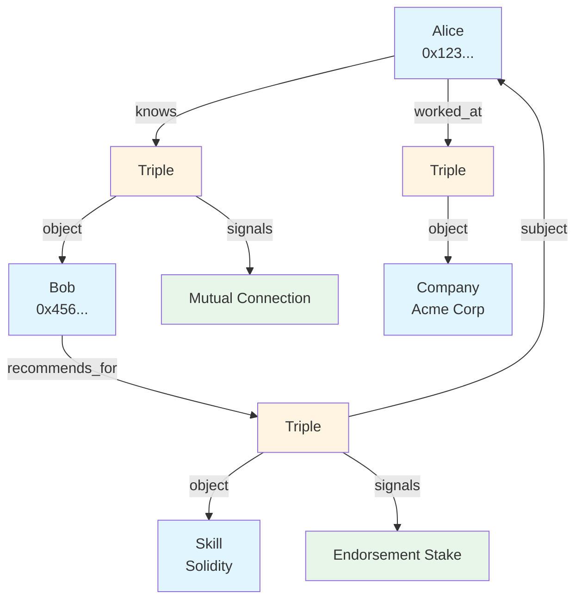

# Building a Social Attestation Platform

Build a decentralized professional network where connections, recommendations, and work history are portable across platforms and verifiable on-chain.

**Time to complete:** 2-3 hours
**Difficulty:** Intermediate
**Prerequisites:**
- SDK installed
- Understanding of atoms and triples
- Basic React knowledge

## What We'll Build

A professional network featuring:
- ✅ Profile atoms from Ethereum addresses
- ✅ Connection triples ("knows" relationships)
- ✅ Recommendation triples with endorsements
- ✅ Experience verification
- ✅ Skill attestations from colleagues
- ✅ Portable, cross-platform identity

Unlike traditional platforms, all data is on-chain, portable, and owned by the user.

## Architecture Overview



**Core Components:**

1. **Profiles** - Ethereum addresses as identity atoms
2. **Connections** - "knows" triples between people
3. **Recommendations** - Skill endorsements from connections
4. **Work History** - "worked_at" triples with companies
5. **Verification** - Signals to confirm attestations

## Part 1: Data Model

### Atoms

**Person Atoms:**
```typescript
{
  type: 'account',
  value: '0x742d35Cc6634C0532925a3b844Bc9e7595f0bEb'
}
```

**Organization Atoms:**
```typescript
{
  type: 'thing',
  value: 'Acme Corporation'
}
```

**Skill Atoms:**
```typescript
{
  type: 'thing',
  value: 'Solidity Development'
}
```

### Predicates

- `knows` - Professional connection
- `worked_at` - Employment relationship
- `recommends_for` - Skill recommendation
- `endorses` - General endorsement
- `verified_by` - Third-party verification

### Triple Examples

**Connection:**
```
[Alice (0x123...)] [knows] [Bob (0x456...)]
```

**Work History:**
```
[Alice (0x123...)] [worked_at] [Acme Corp]
```

**Skill Recommendation:**
```
[Bob (0x456...)] [recommends] [Alice's Solidity Skill]
```
(Where Alice's Solidity Skill is a triple: `[Alice] [has_skill] [Solidity]`)

## Part 2: Creating Profiles

### Initialize SDK

```typescript
import { createMultivault, getAtomId } from '@0xintuition/sdk'

const multivault = createMultivault({
  privateKey: process.env.PRIVATE_KEY!,
  rpcUrl: 'https://sepolia.base.org',
  multivaultAddress: '0x...'
})
```

### Create a Profile

```typescript
async function createProfile(address: string) {
  const atomData = {
    type: 'account',
    value: address.toLowerCase()
  }

  const atomId = getAtomId(atomData)
  const exists = await multivault.atomExists(atomId)

  if (exists) {
    console.log('Profile already exists:', atomId)
    return atomId
  }

  const result = await multivault.createAtom({
    atomUri: atomData
  })

  console.log('Profile created:', result.atomId)
  return result.atomId
}

// Create your profile
const myProfile = await createProfile('0x742d35Cc6634C0532925a3b844Bc9e7595f0bEb')
```

### Store Profile Metadata

Profile metadata (name, bio, avatar) can be stored off-chain:

```typescript
interface ProfileMetadata {
  address: string
  name: string
  bio: string
  avatar: string
  location?: string
  website?: string
}

async function setProfileMetadata(address: string, metadata: ProfileMetadata) {
  // Upload to IPFS
  const ipfsHash = await uploadToIPFS(metadata)

  // Store mapping in database or contract
  await storeMetadataMapping(address, ipfsHash)

  return ipfsHash
}

// Set metadata
await setProfileMetadata('0x742d...', {
  address: '0x742d...',
  name: 'Alice Developer',
  bio: 'Full-stack blockchain developer',
  avatar: 'https://avatar.url/alice.png',
  location: 'San Francisco',
  website: 'https://alice.dev'
})
```

## Part 3: Building Connections

### Create "knows" Predicate

```typescript
async function createKnowsPredicate() {
  const predicateData = {
    type: 'thing',
    value: 'knows'
  }

  const predicateId = getAtomId(predicateData)
  const exists = await multivault.atomExists(predicateId)

  if (!exists) {
    const result = await multivault.createAtom({
      atomUri: predicateData
    })
    return result.atomId
  }

  return predicateId
}

const knowsPredicateId = await createKnowsPredicate()
```

### Send Connection Request

```typescript
async function sendConnectionRequest(fromAddress: string, toAddress: string) {
  // Create atoms for both profiles
  const fromAtomId = await createProfile(fromAddress)
  const toAtomId = await createProfile(toAddress)

  // Create connection triple
  const result = await multivault.createTriple({
    subjectId: fromAtomId,
    predicateId: knowsPredicateId,
    objectId: toAtomId
  })

  console.log('Connection request sent:', result.tripleId)
  return result.tripleId
}

// Alice connects to Bob
const connectionTripleId = await sendConnectionRequest(
  '0x742d...', // Alice
  '0x8b9e...'  // Bob
)
```

### Accept Connection (Mutual)

For mutual connections, Bob creates the reverse triple:

```typescript
async function acceptConnection(tripleId: string) {
  // Get the original triple
  const triple = await getTripleById(tripleId)

  // Create reverse triple
  const result = await multivault.createTriple({
    subjectId: triple.object.id,  // Bob
    predicateId: knowsPredicateId,
    objectId: triple.subject.id   // Alice
  })

  // Optionally, signal on the original triple to confirm
  await multivault.depositTriple({
    id: tripleId,
    amount: BigInt('1000000000000000'), // 0.001 ETH confirmation
    receiver: multivault.getWalletAddress()
  })

  return result.tripleId
}

// Bob accepts Alice's connection
await acceptConnection(connectionTripleId)
```

### Query Connections

```typescript
import { request, gql } from 'graphql-request'

const GRAPHQL_ENDPOINT = 'https://api.intuition.systems/graphql'

const GET_CONNECTIONS = gql`
  query GetConnections($address: String!) {
    triples(
      where: {
        subject: { value: $address }
        predicate: { value: "knows" }
      }
    ) {
      id
      object {
        id
        value
      }
      signals {
        accountId
        delta
      }
    }
  }
`

async function getConnections(address: string) {
  const data = await request(GRAPHQL_ENDPOINT, GET_CONNECTIONS, {
    address: address.toLowerCase()
  })

  return data.triples
}

// Get Alice's connections
const connections = await getConnections('0x742d...')
console.log('Connections:', connections)
```

### Check Mutual Connections

```typescript
async function getMutualConnections(address1: string, address2: string) {
  const connections1 = await getConnections(address1)
  const connections2 = await getConnections(address2)

  // Find common connections
  const set1 = new Set(connections1.map((c: any) => c.object.value))
  const mutual = connections2.filter((c: any) => set1.has(c.object.value))

  return mutual
}
```

## Part 4: Work History

### Create Company Atoms

```typescript
async function createCompany(companyName: string) {
  const atomData = {
    type: 'thing',
    value: companyName
  }

  const atomId = getAtomId(atomData)
  const exists = await multivault.atomExists(atomId)

  if (!exists) {
    const result = await multivault.createAtom({
      atomUri: atomData
    })
    return result.atomId
  }

  return atomId
}

const acmeAtomId = await createCompany('Acme Corporation')
```

### Add Work Experience

```typescript
async function addWorkExperience(
  personAddress: string,
  companyName: string,
  metadata?: {
    title: string
    startDate: string
    endDate?: string
    description: string
  }
) {
  // Create predicate
  const workedAtPredicate = getAtomId({
    type: 'thing',
    value: 'worked_at'
  })

  const predicateExists = await multivault.atomExists(workedAtPredicate)
  if (!predicateExists) {
    await multivault.createAtom({
      atomUri: {
        type: 'thing',
        value: 'worked_at'
      }
    })
  }

  // Create atoms
  const personAtomId = await createProfile(personAddress)
  const companyAtomId = await createCompany(companyName)

  // Create work triple
  const result = await multivault.createTriple({
    subjectId: personAtomId,
    predicateId: workedAtPredicate,
    objectId: companyAtomId
  })

  // Store metadata off-chain
  if (metadata) {
    await storeWorkMetadata(result.tripleId, metadata)
  }

  return result.tripleId
}

// Add experience
await addWorkExperience('0x742d...', 'Acme Corporation', {
  title: 'Senior Blockchain Developer',
  startDate: '2022-01-01',
  endDate: '2024-01-01',
  description: 'Led smart contract development for DeFi protocols'
})
```

### Verify Work Experience

Colleagues can verify by signaling:

```typescript
async function verifyWorkExperience(
  tripleId: string,
  verifierAddress: string,
  amount: bigint
) {
  // Verifier must be connected to the person
  const triple = await getTripleById(tripleId)
  const connections = await getConnections(verifierAddress)

  const isConnected = connections.some(
    (c: any) => c.object.value === triple.subject.value
  )

  if (!isConnected) {
    throw new Error('Must be connected to verify')
  }

  // Deposit signal to verify
  return multivault.depositTriple({
    id: tripleId,
    amount,
    receiver: multivault.getWalletAddress()
  })
}

// Bob verifies Alice's work at Acme
await verifyWorkExperience(
  workTripleId,
  '0x8b9e...', // Bob
  BigInt('100000000000000000') // 0.1 ETH
)
```

## Part 5: Recommendations

### Recommend a Skill

Recommendations are triples pointing to skill claim triples:

```typescript
async function recommendSkill(
  recommenderAddress: string,
  personAddress: string,
  skillName: string,
  stake: bigint
) {
  // First, create or get the skill claim triple
  // [Person] [has_skill] [Skill]
  const hasSkillPredicate = getAtomId({
    type: 'thing',
    value: 'has_skill'
  })

  const personAtomId = await createProfile(personAddress)
  const skillAtomId = getAtomId({
    type: 'thing',
    value: skillName
  })

  // Create skill atom if needed
  const skillExists = await multivault.atomExists(skillAtomId)
  if (!skillExists) {
    await multivault.createAtom({
      atomUri: {
        type: 'thing',
        value: skillName
      }
    })
  }

  // Create skill claim triple
  const skillClaimTriple = await multivault.createTriple({
    subjectId: personAtomId,
    predicateId: hasSkillPredicate,
    objectId: skillAtomId
  })

  // Now the recommender signals on this triple
  const recommenderAtomId = await createProfile(recommenderAddress)

  await multivault.depositTriple({
    id: skillClaimTriple.tripleId,
    amount: stake,
    receiver: multivault.getWalletAddress()
  })

  console.log('Skill recommended:', skillName)
  return skillClaimTriple.tripleId
}

// Bob recommends Alice for Solidity
await recommendSkill(
  '0x8b9e...', // Bob (recommender)
  '0x742d...', // Alice
  'Solidity',
  BigInt('200000000000000000') // 0.2 ETH
)
```

### Request Recommendation

```typescript
async function requestRecommendation(
  fromAddress: string,
  toAddress: string,
  skillName: string
) {
  // Create a recommendation request (off-chain event)
  const request = {
    from: fromAddress,
    to: toAddress,
    skill: skillName,
    requestedAt: Date.now()
  }

  // Store request in database
  await storeRecommendationRequest(request)

  // Optionally notify via email/push notification
  await notifyUser(toAddress, 'recommendation_request', request)

  return request
}
```

### Query Recommendations

```typescript
const GET_RECOMMENDATIONS = gql`
  query GetRecommendations($address: String!) {
    triples(
      where: {
        subject: { value: $address }
        predicate: { value: "has_skill" }
      }
    ) {
      id
      object {
        value
      }
      signals(orderBy: delta, orderDirection: desc) {
        accountId
        delta
      }
    }
  }
`

async function getRecommendations(address: string) {
  const data = await request(GRAPHQL_ENDPOINT, GET_RECOMMENDATIONS, {
    address: address.toLowerCase()
  })

  return data.triples.map((t: any) => ({
    skill: t.object.value,
    recommenders: t.signals.map((s: any) => ({
      address: s.accountId,
      stake: s.delta
    }))
  }))
}

// Get Alice's recommendations
const recs = await getRecommendations('0x742d...')
console.log('Recommendations:', recs)
```

## Part 6: UI Components

### Profile Component

```tsx
import React, { useEffect, useState } from 'react'

interface Profile {
  address: string
  name: string
  bio: string
  avatar: string
  connections: number
  recommendations: any[]
}

export function ProfilePage({ address }: { address: string }) {
  const [profile, setProfile] = useState<Profile | null>(null)
  const [loading, setLoading] = useState(true)

  useEffect(() => {
    async function loadProfile() {
      // Load metadata
      const metadata = await getProfileMetadata(address)

      // Load connections
      const connections = await getConnections(address)

      // Load recommendations
      const recs = await getRecommendations(address)

      setProfile({
        address,
        name: metadata.name,
        bio: metadata.bio,
        avatar: metadata.avatar,
        connections: connections.length,
        recommendations: recs
      })

      setLoading(false)
    }

    loadProfile()
  }, [address])

  if (loading) return <div>Loading profile...</div>
  if (!profile) return <div>Profile not found</div>

  return (
    <div className="profile-page">
      <div className="profile-header">
        
        <div className="profile-info">
          <h1>{profile.name}</h1>
          <p className="address">{profile.address}</p>
          <p className="bio">{profile.bio}</p>
          <div className="stats">
            <span>{profile.connections} connections</span>
            <span>{profile.recommendations.length} skills</span>
          </div>
        </div>
      </div>

      <div className="profile-sections">
        <RecommendationsSection recommendations={profile.recommendations} />
        <ConnectionsSection address={address} />
        <WorkHistorySection address={address} />
      </div>
    </div>
  )
}

function RecommendationsSection({ recommendations }: { recommendations: any[] }) {
  return (
    <div className="recommendations-section">
      <h2>Skills & Recommendations</h2>
      {recommendations.map(rec => (
        <div key={rec.skill} className="skill-card">
          <h3>{rec.skill}</h3>
          <div className="recommenders">
            {rec.recommenders.map((r: any) => (
              <div key={r.address} className="recommender">
                <span>{r.address.slice(0, 6)}...</span>
                <span>{(Number(r.stake) / 1e18).toFixed(2)} ETH</span>
              </div>
            ))}
          </div>
        </div>
      ))}
    </div>
  )
}
```

### Connection Request Component

```tsx
export function ConnectionButton({ targetAddress }: { targetAddress: string }) {
  const [status, setStatus] = useState<'none' | 'pending' | 'connected'>('none')
  const [loading, setLoading] = useState(false)

  useEffect(() => {
    async function checkConnection() {
      const myAddress = await getCurrentUserAddress()
      const connections = await getConnections(myAddress)

      const isConnected = connections.some(
        (c: any) => c.object.value === targetAddress.toLowerCase()
      )

      setStatus(isConnected ? 'connected' : 'none')
    }

    checkConnection()
  }, [targetAddress])

  async function handleConnect() {
    setLoading(true)
    try {
      const myAddress = await getCurrentUserAddress()
      await sendConnectionRequest(myAddress, targetAddress)
      setStatus('pending')
      alert('Connection request sent!')
    } catch (error) {
      alert('Error sending request')
    } finally {
      setLoading(false)
    }
  }

  if (status === 'connected') {
    return <button disabled>Connected</button>
  }

  if (status === 'pending') {
    return <button disabled>Request Pending</button>
  }

  return (
    <button onClick={handleConnect} disabled={loading}>
      {loading ? 'Connecting...' : 'Connect'}
    </button>
  )
}
```

### Recommend Skill Component

```tsx
export function RecommendSkillForm({
  personAddress
}: {
  personAddress: string
}) {
  const [skill, setSkill] = useState('')
  const [stake, setStake] = useState('0.1')
  const [loading, setLoading] = useState(false)

  async function handleRecommend() {
    setLoading(true)
    try {
      const myAddress = await getCurrentUserAddress()
      const stakeWei = BigInt(parseFloat(stake) * 1e18)

      await recommendSkill(myAddress, personAddress, skill, stakeWei)
      alert(`Recommended ${skill}!`)
      setSkill('')
    } catch (error) {
      alert('Error recommending skill')
    } finally {
      setLoading(false)
    }
  }

  return (
    <div className="recommend-form">
      <h3>Recommend a Skill</h3>
      <input
        type="text"
        value={skill}
        onChange={(e) => setSkill(e.target.value)}
        placeholder="Skill name (e.g., Solidity)"
      />
      <input
        type="number"
        step="0.01"
        value={stake}
        onChange={(e) => setStake(e.target.value)}
        placeholder="Stake amount (ETH)"
      />
      <button onClick={handleRecommend} disabled={loading || !skill}>
        {loading ? 'Recommending...' : `Recommend with ${stake} ETH`}
      </button>
    </div>
  )
}
```

### Network Graph Visualization

```tsx
import { useEffect, useRef } from 'react'
import * as d3 from 'd3'

export function NetworkGraph({ centerAddress }: { centerAddress: string }) {
  const svgRef = useRef<SVGSVGElement>(null)

  useEffect(() => {
    async function buildGraph() {
      // Get connections
      const connections = await getConnections(centerAddress)

      // Build nodes and links
      const nodes = [
        { id: centerAddress, label: 'You' },
        ...connections.map((c: any) => ({
          id: c.object.value,
          label: c.object.value.slice(0, 6) + '...'
        }))
      ]

      const links = connections.map((c: any) => ({
        source: centerAddress,
        target: c.object.value
      }))

      // Render with D3
      const svg = d3.select(svgRef.current)
      const width = 800
      const height = 600

      const simulation = d3.forceSimulation(nodes)
        .force('link', d3.forceLink(links).id((d: any) => d.id))
        .force('charge', d3.forceManyBody().strength(-300))
        .force('center', d3.forceCenter(width / 2, height / 2))

      // Draw links
      svg.selectAll('line')
        .data(links)
        .join('line')
        .attr('stroke', '#999')

      // Draw nodes
      svg.selectAll('circle')
        .data(nodes)
        .join('circle')
        .attr('r', 10)
        .attr('fill', (d: any) => d.id === centerAddress ? '#4CAF50' : '#2196F3')

      // Update positions on tick
      simulation.on('tick', () => {
        svg.selectAll('line')
          .attr('x1', (d: any) => d.source.x)
          .attr('y1', (d: any) => d.source.y)
          .attr('x2', (d: any) => d.target.x)
          .attr('y2', (d: any) => d.target.y)

        svg.selectAll('circle')
          .attr('cx', (d: any) => d.x)
          .attr('cy', (d: any) => d.y)
      })
    }

    buildGraph()
  }, [centerAddress])

  return <svg ref={svgRef} width={800} height={600} />
}
```

## Part 7: Advanced Features

### Trust Scores

Calculate trust based on network depth:

```typescript
async function calculateTrustScore(
  fromAddress: string,
  toAddress: string,
  maxDepth: number = 3
): Promise<number> {
  // BFS to find shortest path
  const queue = [{ address: fromAddress, depth: 0 }]
  const visited = new Set([fromAddress])

  while (queue.length > 0) {
    const { address, depth } = queue.shift()!

    if (address === toAddress) {
      // Found! Trust decays with distance
      return 1 / (depth + 1)
    }

    if (depth >= maxDepth) continue

    const connections = await getConnections(address)

    for (const conn of connections) {
      const nextAddr = conn.object.value
      if (!visited.has(nextAddr)) {
        visited.add(nextAddr)
        queue.push({ address: nextAddr, depth: depth + 1 })
      }
    }
  }

  // Not connected
  return 0
}
```

### Portable Identity Export

Export profile data:

```typescript
interface PortableIdentity {
  address: string
  metadata: ProfileMetadata
  connections: string[]
  skills: Array<{
    skill: string
    recommenders: string[]
    totalStake: string
  }>
  workHistory: Array<{
    company: string
    title: string
    verified: boolean
  }>
}

async function exportIdentity(address: string): Promise<PortableIdentity> {
  const metadata = await getProfileMetadata(address)
  const connections = await getConnections(address)
  const recs = await getRecommendations(address)
  const work = await getWorkHistory(address)

  return {
    address,
    metadata,
    connections: connections.map((c: any) => c.object.value),
    skills: recs,
    workHistory: work
  }
}

// Export and save
const identity = await exportIdentity('0x742d...')
const json = JSON.stringify(identity, null, 2)
downloadFile('identity.json', json)
```

## Complete Example

```typescript
class SocialAttestationPlatform {
  private multivault: any
  private predicates: Map<string, string>

  constructor(config: any) {
    this.multivault = createMultivault(config)
    this.predicates = new Map()
  }

  async initialize() {
    const predicateNames = ['knows', 'worked_at', 'has_skill', 'recommends']

    for (const name of predicateNames) {
      const id = await this.getOrCreatePredicate(name)
      this.predicates.set(name, id)
    }
  }

  async connect(fromAddress: string, toAddress: string) {
    const fromId = await this.getOrCreateProfile(fromAddress)
    const toId = await this.getOrCreateProfile(toAddress)

    const result = await this.multivault.createTriple({
      subjectId: fromId,
      predicateId: this.predicates.get('knows')!,
      objectId: toId
    })

    return result.tripleId
  }

  async recommendSkill(
    recommender: string,
    person: string,
    skill: string,
    stake: bigint
  ) {
    // Implementation from Part 5
    // ...
  }

  private async getOrCreateProfile(address: string) {
    // Implementation from Part 2
    // ...
  }

  private async getOrCreatePredicate(name: string) {
    // Implementation
    // ...
  }
}

// Usage
const platform = new SocialAttestationPlatform(config)
await platform.initialize()

await platform.connect('0xAlice...', '0xBob...')
await platform.recommendSkill('0xBob...', '0xAlice...', 'Solidity', BigInt('1e18'))
```

## Next Steps

Explore related tutorials:

1. **[Reputation System](/docs/guides/tutorials/reputation-system)** - Deeper skill reputation
2. **[Fraud Detection](/docs/guides/tutorials/fraud-detection)** - Verify claims
3. **[Curated Lists](/docs/guides/tutorials/curated-lists)** - Professional registries

## Example Repository

```bash
git clone https://github.com/0xIntuition/social-attestations-example
```

## Resources

- [SDK Documentation](/docs/guides/developer-tools/sdk/getting-started)
- [GraphQL API](/docs/guides/developer-tools/graphql-api/overview)
- [Discord Community](https://discord.gg/RgBenkX4mx)

---

Built with Intuition - The Universal Reputation Protocol
