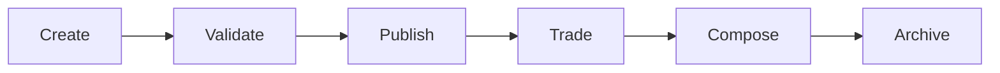

# Atoms

Atoms are the fundamental building blocks of the Intuition system. They represent unique, verifiable pieces of information that can be referenced, traded, and used to build more complex structures.

> **Think of atoms as the "nouns" of the Intuition universe** - they represent the things, people, places, and concepts that make up our digital world.

## What are Atoms?

Atoms are cryptographically unique identifiers that represent specific pieces of information or data. Each atom has:

| Component | Description |
|-----------|-------------|
| **Unique ID** | A cryptographic hash that ensures uniqueness |
| **Content** | The actual data or information being represented |
| **Metadata** | Additional information about creation, ownership, and usage |
| **Verification** | Cryptographic proofs that ensure authenticity |

### **Atom Structure**

```
┌─────────────────────────────────────┐
│              ATOM                   │
├─────────────────────────────────────┤
│ ID: 0x1234...abcd                  │
│ Content: "Your data here"          │
│ Metadata: {tags, author, etc}      │
│ Verification: Cryptographic proof   │
└─────────────────────────────────────┘
```

## Creating Atoms

Atoms can be created for various types of content:

### **Text Content**
- Articles, blog posts, comments
- Documentation, guides, tutorials
- Social media posts, messages

### **Media**
- Images, videos, audio files
- GIFs, memes, digital art
- Podcasts, music, sound clips

### **Data**
- Structured data, API responses
- Database records, spreadsheets
- Sensor data, metrics, analytics

### **References**
- Links to external resources
- URLs, IPFS hashes, blockchain addresses
- Cross-platform identifiers

## Using Atoms

### **Referencing Atoms**
Atoms can be referenced in other parts of the system, creating a network of interconnected information.

```javascript
// Referencing an existing atom
const atomReference = {
  atomId: "0x1234...abcd",
  context: "This atom represents a blog post",
  relationship: "quotes"
}
```

### **Trading Atoms**
Atoms can be traded using bonding curves, allowing for dynamic pricing based on demand.

```javascript
// Trading an atom
const trade = await protocol.atoms.tradeAtom(
  atomId,
  amount,
  curveId
);
```

### **Composing with Atoms**
Atoms can be combined to create more complex structures like triples and signals.

```javascript
// Using atoms in a triple
const triple = {
  subject: atom1,    // "Alice"
  predicate: atom2,  // "likes"
  object: atom3      // "Pizza"
};
```

## Best Practices

### **Quality Guidelines**

| Practice | Description |
|----------|-------------|
| **Unique Content** | Ensure each atom represents truly unique information |
| **Clear Metadata** | Provide comprehensive metadata for better discoverability |
| **Verification** | Always verify atom authenticity before use |
| **Composability** | Design atoms to work well with other primitives |

### **Common Pitfalls**

- **Duplicate Content**: Don't create atoms for identical information
- **Poor Metadata**: Avoid sparse or unclear metadata
- **Unverified Sources**: Always verify atom authenticity
- **Isolated Design**: Don't create atoms that can't be composed

## Examples

### **Blog Post Atom**

```javascript
// Creating an atom for a blog post
const blogPostAtom = {
  id: "0x1234567890abcdef...",
  content: {
    title: "Building with Intuition",
    body: "This is my blog post content...",
    author: "alice.eth",
    publishedAt: "2024-01-01T00:00:00Z"
  },
  metadata: {
    tags: ["intuition", "web3", "development"],
    category: "tutorial",
    language: "en",
    wordCount: 1500
  },
  verification: {
    signature: "0xabc123...",
    timestamp: "2024-01-01T00:00:00Z"
  }
}
```

### **Digital Art Atom**

```javascript
// Creating an atom for digital art
const artAtom = {
  id: "0xabcdef1234567890...",
  content: {
    title: "Cosmic Dreams",
    fileHash: "ipfs://QmHash...",
    fileType: "image/png",
    dimensions: "1920x1080"
  },
  metadata: {
    artist: "bob.eth",
    collection: "Cosmic Series",
    rarity: "legendary",
    edition: "1 of 1"
  }
}
```

### **Data Atom**

```javascript
// Creating an atom for structured data
const dataAtom = {
  id: "0x7890abcdef123456...",
  content: {
    type: "price_data",
    symbol: "ETH/USD",
    price: 2500.50,
    timestamp: "2024-01-01T12:00:00Z"
  },
  metadata: {
    source: "coinbase_api",
    confidence: 0.99,
    updateFrequency: "1min"
  }
}
```

## Advanced Usage

### **Atom Lifecycle**



### **Atom Patterns**

| Pattern | Use Case | Example |
|---------|----------|---------|
| **Tagged Atoms** | Categorization | Blog posts with tags |
| **Linked Atoms** | Relationships | User profiles with connections |
| **Data Atoms** | Analytics | Price feeds, metrics |
| **Media Atoms** | Content | Images, videos, audio |

---

> **Ready to create your first atom?** Check out our [Quick Start Guide](/guides/quickstart) or explore the [SDK Documentation](/guides/developer-tools/sdks) to begin building! 