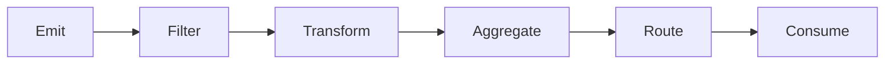

# Signals

Signals are dynamic, time-based data streams that represent real-time information, events, and state changes within the Intuition system. They enable reactive applications and real-time collaboration.

> **Think of signals as the "verbs" of the Intuition universe** - they represent the actions, events, and changes that happen in real-time across the network.

## What are Signals?

Signals are continuous data streams that:

| Feature | Description |
|---------|-------------|
| **Real-Time Updates** | Reflect current state and changes as they happen |
| **Rich Metadata** | Include timing, source, and context information |
| **Subscription Support** | Allow applications to subscribe to specific signal types |
| **Reactive Triggers** | Enable automatic updates in connected systems |

### **Signal Flow**

```
┌─────────────┐    ┌─────────────┐    ┌─────────────┐
│   Source    │───▶│   Signal    │───▶│  Subscriber │
│  (Event)    │    │  (Stream)   │    │ (Listener)  │
└─────────────┘    └─────────────┘    └─────────────┘
```

## Signal Types

### **Event Signals**
Signals that represent discrete events or actions:

| Event Type | Examples |
|------------|----------|
| **User Interactions** | Clicks, form submissions, navigation |
| **System Events** | Contract calls, state changes, errors |
| **External APIs** | Price updates, weather data, news feeds |
| **Smart Contracts** | Token transfers, governance votes, trades |

### **State Signals**
Signals that represent continuous state information:

| State Type | Examples |
|------------|----------|
| **Current Prices** | Token prices, asset valuations, market data |
| **Network Status** | Connection health, node availability, latency |
| **User Presence** | Online status, activity levels, engagement |
| **System Metrics** | Performance, usage statistics, analytics |

### **Aggregate Signals**
Signals that combine multiple data sources:

| Aggregate Type | Examples |
|----------------|----------|
| **Trending Topics** | Popular content, viral posts, hot discussions |
| **Popular Content** | Most viewed, shared, or engaged content |
| **Network Activity** | Transaction volume, user activity, system load |
| **Economic Indicators** | Market sentiment, adoption metrics, growth rates |

## Creating Signals

### **Signal Definition**
Define the structure and behavior of your signal:

```javascript
const signalDefinition = {
  type: "price-update",
  schema: {
    price: "number",
    timestamp: "string",
    source: "string",
    confidence: "number"
  },
  updateFrequency: "realtime",
  retention: "24h"
}
```

### **Signal Sources**
Signals can originate from:

| Source | Description |
|--------|-------------|
| **Smart Contract Events** | Blockchain transactions, state changes |
| **User Interactions** | Clicks, form submissions, social actions |
| **External APIs** | Third-party data feeds, webhooks |
| **System Monitoring** | Performance metrics, health checks |
| **Other Signals** | Signal composition and transformation |

## Using Signals

### **Subscribing to Signals**
Applications can subscribe to specific signals to receive real-time updates.

```javascript
// Basic signal subscription
const subscription = subscribeToSignal("price-update", {
  onUpdate: (signal) => {
    console.log(`Price: ${signal.price}`);
    updateUI(signal);
  }
});
```

### **Signal Processing**
Process and transform signals to extract meaningful information.

```javascript
// Processing signals with filters
const processedSignal = processSignal(rawSignal, {
  filter: (signal) => signal.price > 100,
  transform: (signal) => ({
    ...signal,
    priceUSD: signal.price * exchangeRate
  })
});
```

### **Signal Composition**
Combine multiple signals to create more complex data streams.

```javascript
// Composing multiple signals
const compositeSignal = composeSignals([
  "price-update",
  "volume-update",
  "sentiment-update"
], {
  aggregation: "weighted-average",
  weights: [0.4, 0.3, 0.3]
});
```

## Signal Patterns

### **Filtering**
Filter signals based on specific criteria or conditions.

```javascript
// Filtering signals
const filteredSignals = filterSignals(signals, {
  price: (value) => value > 100,
  timestamp: (value) => isRecent(value),
  source: (value) => trustedSources.includes(value)
});
```

### **Aggregation**
Combine multiple signals to create summary information.

```javascript
// Aggregating signals
const aggregatedSignal = aggregateSignals(signals, {
  method: "average",
  window: "5min",
  groupBy: "symbol"
});
```

### **Transformation**
Transform signal data into different formats or structures.

```javascript
// Transforming signals
const transformedSignal = transformSignal(signal, {
  price: (value) => formatCurrency(value),
  timestamp: (value) => formatDate(value),
  confidence: (value) => calculateConfidence(value)
});
```

### **Routing**
Route signals to different destinations based on content or rules.

```javascript
// Routing signals
const router = createSignalRouter({
  "price-alerts": (signal) => sendNotification(signal),
  "trading-signals": (signal) => executeTrade(signal),
  "analytics": (signal) => logAnalytics(signal)
});
```

## Best Practices

### **Performance Guidelines**

| Practice | Description |
|----------|-------------|
| **Efficient Updates** | Minimize unnecessary signal updates |
| **Clear Schema** | Define clear schemas for signal data |
| **Error Handling** | Implement robust error handling |
| **Performance Monitoring** | Consider performance implications |

### **Common Pitfalls**

- **Over-subscription**: Don't subscribe to unnecessary signals
- **Poor filtering**: Avoid processing irrelevant data
- **Memory leaks**: Always clean up subscriptions
- **Inconsistent schemas**: Maintain consistent data structures

## Examples

### **Price Signal Subscription**

```javascript
// Subscribing to a price signal with filtering
const priceSubscription = subscribeToSignal("price-update", {
  filter: (signal) => signal.price > 100 && signal.confidence > 0.8,
  onUpdate: (signal) => {
    console.log(`High-confidence price update: ${signal.price}`);
    updatePriceChart(signal);
    checkAlerts(signal);
  },
  onError: (error) => {
    console.error("Price signal error:", error);
    fallbackToCachedData();
  }
});
```

### **Gaming Signal Processing**

```javascript
// Processing gaming signals
const gameSignalProcessor = {
  "player-move": (signal) => {
    validateMove(signal);
    updateGameState(signal);
    broadcastToOtherPlayers(signal);
  },
  "chat-message": (signal) => {
    filterInappropriateContent(signal);
    broadcastToRoom(signal);
    logChatActivity(signal);
  },
  "game-event": (signal) => {
    updateLeaderboard(signal);
    awardPoints(signal);
    triggerAchievements(signal);
  }
};
```

### **Analytics Signal Aggregation**

```javascript
// Aggregating analytics signals
const analyticsAggregator = createSignalAggregator({
  signals: ["page-view", "click", "scroll", "time-spent"],
  window: "1hour",
  aggregations: {
    "page-views": "count",
    "avg-time-spent": "average",
    "bounce-rate": "calculated",
    "engagement-score": "weighted"
  },
  onAggregate: (data) => {
    updateDashboard(data);
    triggerInsights(data);
    sendReports(data);
  }
});
```

## Advanced Usage

### **Signal Lifecycle**



### **Signal Patterns**

| Pattern | Use Case | Example |
|---------|----------|---------|
| **Event Streams** | Real-time updates | Price feeds, notifications |
| **State Management** | Application state | UI updates, data sync |
| **Reactive Systems** | Automatic responses | Trading bots, alerts |
| **Analytics** | Data collection | User behavior, metrics |

---

> **Ready to build reactive applications?** Check out our [Quick Start Guide](/guides/quickstart) or explore the [SDK Documentation](/guides/developer-tools/sdks) to begin building with signals! 