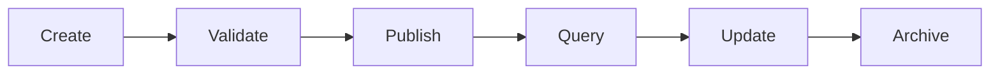

# Triples

Triples are structured data units that connect three atoms together in a subject-predicate-object relationship. They form the foundation for creating semantic networks and knowledge graphs within the Intuition system.

> **Think of triples as the "sentences" of the Intuition universe** - they represent the relationships and connections between different atoms, creating meaning through structured relationships.

## What are Triples?

A triple consists of three atoms connected in a specific relationship:

| Component | Description | Example |
|-----------|-------------|---------|
| **Subject** | The entity being described | "Alice", "Article123", "CompanyABC" |
| **Predicate** | The relationship or property | "likes", "hasTag", "locatedIn" |
| **Object** | The value or target of the relationship | "Pizza", "Technology", "San Francisco" |

### **Triple Structure**

```
┌─────────────┐    ┌─────────────┐    ┌─────────────┐
│   Subject   │───▶│  Predicate  │───▶│   Object    │
│   (Atom)    │    │  (Atom)     │    │   (Atom)    │
└─────────────┘    └─────────────┘    └─────────────┘
```

### **Real Examples**

| Subject | Predicate | Object |
|---------|-----------|--------|
| `User123` | `likes` | `Post456` |
| `Article789` | `hasTag` | `Technology` |
| `CompanyABC` | `locatedIn` | `San Francisco` |
| `Alice` | `follows` | `Bob` |
| `ProductXYZ` | `hasPrice` | `$29.99` |

## Creating Triples

### **Basic Triple Creation**
Triples are created by connecting three existing atoms with a specific relationship.

```javascript
// Creating a basic triple
const triple = {
  subject: "user-alice",
  predicate: "likes",
  object: "post-123",
  metadata: {
    createdAt: "2024-01-01T00:00:00Z",
    confidence: 0.95,
    source: "user-action"
  }
};
```

### **Validating Triples**
Each triple must be validated to ensure:

| Validation | Description |
|------------|-------------|
| **Atom Existence** | All three atoms must exist in the system |
| **Meaningful Relationship** | The relationship must be semantically valid |
| **System Constraints** | Follows Intuition's triple constraints |
| **Permission Check** | Creator has permission to create the relationship |

## Using Triples

### 🌐 **Building Knowledge Graphs**
Triples can be connected to form complex knowledge graphs that represent relationships between entities.

```javascript
// Building a knowledge graph
const knowledgeGraph = {
  nodes: [atom1, atom2, atom3, atom4],
  edges: [
    { subject: atom1, predicate: "knows", object: atom2 },
    { subject: atom2, predicate: "worksAt", object: atom3 },
    { subject: atom3, predicate: "locatedIn", object: atom4 }
  ]
};
```

### **Querying Relationships**
Triples enable powerful queries to find connections and patterns in the data.

```javascript
// Querying relationships
const relationships = await queryTriples({
  subject: "alice",
  predicate: "likes",
  limit: 10
});

// Find all posts that Alice likes
const aliceLikes = await queryTriples({
  subject: "alice",
  predicate: "likes"
});
```

### **Semantic Search**
Triples provide the foundation for semantic search capabilities across the network.

```javascript
// Semantic search example
const searchResults = await semanticSearch({
  query: "technology companies in San Francisco",
  filters: {
    predicate: "locatedIn",
    object: "San Francisco"
  }
});
```

## Triple Types

### **Standard Triples**
Basic subject-predicate-object relationships.

```javascript
// Standard triple
const standardTriple = {
  subject: "user-123",
  predicate: "likes",
  object: "post-456"
};
```

### **Qualified Triples**
Triples with additional metadata or qualifications.

```javascript
// Qualified triple with metadata
const qualifiedTriple = {
  subject: "user-123",
  predicate: "likes",
  object: "post-456",
  qualifications: {
    intensity: "strong",
    context: "social-media",
    timestamp: "2024-01-01T12:00:00Z"
  }
};
```

### **Temporal Triples**
Triples that include time-based information.

```javascript
// Temporal triple
const temporalTriple = {
  subject: "user-123",
  predicate: "wasAt",
  object: "location-456",
  temporal: {
    startTime: "2024-01-01T10:00:00Z",
    endTime: "2024-01-01T12:00:00Z"
  }
};
```

## Best Practices

### **Quality Guidelines**

| Practice | Description |
|----------|-------------|
| **Meaningful Relationships** | Ensure predicates represent meaningful connections |
| **Consistent Naming** | Use consistent naming conventions for predicates |
| **Validation** | Always validate triples before publishing |
| **Reusability** | Design triples to be reusable across contexts |

### **Common Pitfalls**

- **Ambiguous predicates**: Avoid vague relationship names
- **Circular references**: Don't create self-referential triples
- **Inconsistent naming**: Use standardized predicate names
- **Poor validation**: Always validate before publishing

## Examples

### **Social Network Triple**

```javascript
// Social network relationships
const socialTriples = [
  {
    subject: "alice.eth",
    predicate: "follows",
    object: "bob.eth",
    metadata: {
      createdAt: "2024-01-01T00:00:00Z",
      source: "user-action"
    }
  },
  {
    subject: "alice.eth",
    predicate: "likes",
    object: "post-123",
    metadata: {
      createdAt: "2024-01-01T12:00:00Z",
      intensity: "strong"
    }
  },
  {
    subject: "bob.eth",
    predicate: "posted",
    object: "post-123",
    metadata: {
      createdAt: "2024-01-01T10:00:00Z",
      platform: "twitter"
    }
  }
];
```

### **Business Relationship Triple**

```javascript
// Business relationships
const businessTriples = [
  {
    subject: "company-abc",
    predicate: "employs",
    object: "person-123",
    metadata: {
      role: "software-engineer",
      startDate: "2023-01-01",
      department: "engineering"
    }
  },
  {
    subject: "company-abc",
    predicate: "locatedIn",
    object: "san-francisco",
    metadata: {
      officeType: "headquarters",
      address: "123 Main St"
    }
  },
  {
    subject: "company-abc",
    predicate: "competesWith",
    object: "company-xyz",
    metadata: {
      industry: "technology",
      market: "saas"
    }
  }
];
```

### **Knowledge Graph Triple**

```javascript
// Knowledge graph relationships
const knowledgeTriples = [
  {
    subject: "albert-einstein",
    predicate: "discovered",
    object: "theory-of-relativity",
    metadata: {
      year: 1905,
      field: "physics",
      impact: "revolutionary"
    }
  },
  {
    subject: "theory-of-relativity",
    predicate: "influenced",
    object: "quantum-mechanics",
    metadata: {
      influenceType: "theoretical",
      significance: "high"
    }
  },
  {
    subject: "quantum-mechanics",
    predicate: "enabled",
    object: "quantum-computing",
    metadata: {
      application: "computing",
      timeline: "modern"
    }
  }
];
```

## Advanced Usage

### **Triple Lifecycle**



### **Triple Patterns**

| Pattern | Use Case | Example |
|---------|----------|---------|
| **Social Networks** | User relationships | Follows, likes, shares |
| **Business Networks** | Company relationships | Employs, partners, competes |
| **Knowledge Graphs** | Information relationships | Discovers, influences, enables |
| **Content Networks** | Content relationships | Tags, categories, references |

### **Query Patterns**

```javascript
// Common query patterns
const queryPatterns = {
  // Find all relationships for a subject
  subjectRelationships: (subject) => ({
    subject: subject
  }),
  
  // Find all relationships with a specific predicate
  predicateRelationships: (predicate) => ({
    predicate: predicate
  }),
  
  // Find all objects for a subject-predicate pair
  subjectPredicateObjects: (subject, predicate) => ({
    subject: subject,
    predicate: predicate
  }),
  
  // Find all subjects that relate to an object
  objectRelationships: (object) => ({
    object: object
  })
};
```

---

> **Ready to build knowledge graphs?** Check out our [Quick Start Guide](/guides/quickstart) or explore the [SDK Documentation](/guides/developer-tools/sdks) to begin creating triples! 