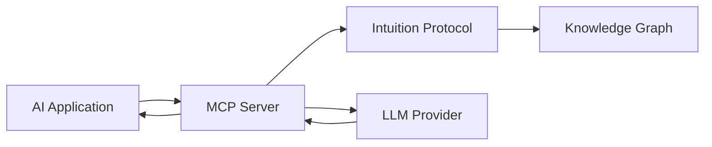

# Intuition MCP Server

The Intuition MCP (Model Context Protocol) Server enables AI models to interact directly with the Intuition knowledge graph, providing structured access to decentralized data and enabling AI-powered applications.

## Overview

The MCP Server acts as a bridge between AI models and the Intuition protocol, allowing for:
- **Semantic Queries**: AI models can query the knowledge graph using natural language
- **Data Creation**: Create Atoms and Triples programmatically through AI
- **Signal Analysis**: Leverage AI for intelligent signal attestation
- **Context Enhancement**: Enrich AI responses with verified on-chain data

## GitHub Repository

<div style={{
  padding: '2rem',
  borderRadius: '12px',
  background: 'linear-gradient(135deg, #6B73FF 0%, #000DFF 100%)',
  textAlign: 'center',
  margin: '2rem 0'
}}>
  <h3 style={{ color: 'white', marginBottom: '1rem' }}>
    Intuition MCP Server
  </h3>
  <p style={{ color: 'rgba(255,255,255,0.9)', marginBottom: '1.5rem' }}>
    Open-source Model Context Protocol server for AI integration
  </p>
  <a 
    href="https://github.com/0xIntuition/intuition-mcp-server" 
    target="_blank" 
    rel="noopener noreferrer"
    style={{
      display: 'inline-block',
      padding: '12px 32px',
      backgroundColor: 'white',
      color: '#6B73FF',
      borderRadius: '8px',
      textDecoration: 'none',
      fontWeight: 'bold',
      fontSize: '1.1rem',
      transition: 'transform 0.2s',
    }}
    onMouseOver={(e) => e.currentTarget.style.transform = 'scale(1.05)'}
    onMouseOut={(e) => e.currentTarget.style.transform = 'scale(1)'}
  >
    View on GitHub →
  </a>
</div>

## Key Features

### 🤖 **AI-Native Integration**
- Seamless connection between AI models and blockchain data
- Natural language processing for query interpretation
- Automatic context management for complex queries
- Response formatting optimized for AI consumption

### 🔗 **Protocol Operations**
- Create and manage Atoms through AI commands
- Form semantic Triples based on AI analysis
- Generate Signals with AI-driven validation
- Query existing knowledge graph data

### 🛡️ **Security & Validation**
- Secure key management for on-chain operations
- Input validation and sanitization
- Rate limiting and access control
- Audit logging for all operations

### 📊 **Analytics & Insights**
- AI-powered pattern recognition
- Trend analysis across the knowledge graph
- Automated report generation
- Predictive modeling capabilities

## Installation

### Prerequisites
- Node.js 18+ or Python 3.8+
- Intuition API credentials
- OpenAI API key (or compatible LLM)

### Quick Start

```bash
# Clone the repository
git clone https://github.com/0xIntuition/intuition-mcp-server
cd intuition-mcp-server

# Install dependencies
npm install

# Configure environment
cp .env.example .env
# Edit .env with your credentials

# Start the server
npm start
```

## Configuration

### Environment Variables
```env
# Intuition Configuration
INTUITION_API_KEY=your_api_key
INTUITION_NETWORK=mainnet|testnet

# MCP Configuration
MCP_PORT=3000
MCP_HOST=localhost

# AI Model Configuration
OPENAI_API_KEY=your_openai_key
MODEL_NAME=gpt-4
```

### Server Configuration
```javascript
{
  "server": {
    "port": 3000,
    "host": "localhost",
    "cors": {
      "enabled": true,
      "origins": ["http://localhost:*"]
    }
  },
  "intuition": {
    "network": "testnet",
    "maxRetries": 3,
    "timeout": 30000
  },
  "ai": {
    "model": "gpt-4",
    "temperature": 0.7,
    "maxTokens": 2000
  }
}
```

## Usage Examples

### Query Knowledge Graph
```python
# Python example
from intuition_mcp import MCPClient

client = MCPClient("http://localhost:3000")

# Natural language query
response = client.query(
    "What are the most trusted DeFi protocols according to the knowledge graph?"
)

print(response.results)
```

### Create Knowledge Entry
```javascript
// JavaScript example
const { MCPClient } = require('intuition-mcp-client');

const client = new MCPClient('http://localhost:3000');

// Create a new fact
const result = await client.create({
  type: 'triple',
  subject: 'Ethereum',
  predicate: 'has-feature',
  object: 'Smart Contracts',
  context: 'Ethereum supports programmable smart contracts'
});

console.log('Triple created:', result.id);
```

### AI-Powered Analysis
```typescript
// TypeScript example
import { MCPServer } from 'intuition-mcp-server';

const server = new MCPServer();

// Analyze trends
const analysis = await server.analyze({
  topic: 'DeFi Protocols',
  timeframe: '30d',
  metrics: ['trust_score', 'usage_volume', 'signal_strength']
});

console.log('Analysis:', analysis);
```

## Architecture

### System Components



### Request Flow

1. **AI Request**: Application sends query/command to MCP Server
2. **Processing**: Server interprets intent and validates parameters
3. **Protocol Interaction**: Executes operations on Intuition network
4. **AI Enhancement**: Optionally enhances response with LLM
5. **Response**: Returns structured data to application

## API Reference

### Endpoints

#### `POST /query`
Query the knowledge graph
```json
{
  "query": "string",
  "filters": {},
  "limit": 100
}
```

#### `POST /create`
Create new knowledge entries
```json
{
  "type": "atom|triple",
  "data": {},
  "metadata": {}
}
```

#### `POST /signal`
Add signal attestation
```json
{
  "target": "atom_or_triple_id",
  "direction": "positive|negative",
  "stake": 100
}
```

#### `POST /analyze`
AI-powered analysis
```json
{
  "topic": "string",
  "parameters": {},
  "model": "gpt-4"
}
```

## Advanced Features

### Custom Plugins
Extend functionality with plugins:
```javascript
class CustomPlugin {
  constructor(server) {
    this.server = server;
  }

  async process(request) {
    // Custom logic here
    return response;
  }
}

server.registerPlugin(new CustomPlugin());
```

### Webhook Integration
Configure webhooks for events:
```javascript
{
  "webhooks": {
    "onAtomCreated": "https://your-api.com/webhook",
    "onSignalAdded": "https://your-api.com/webhook"
  }
}
```

### Batch Operations
Process multiple operations efficiently:
```javascript
const batch = await client.batch([
  { action: 'create', type: 'atom', data: {...} },
  { action: 'create', type: 'triple', data: {...} },
  { action: 'signal', target: 'id', stake: 100 }
]);
```

## Security Considerations

### Authentication
- API key authentication required
- JWT token support for session management
- Role-based access control (RBAC)

### Data Privacy
- End-to-end encryption for sensitive data
- Local key storage with hardware security module support
- Zero-knowledge proof integration (coming soon)

### Rate Limiting
- Default: 100 requests per minute
- Configurable per API key
- Burst allowance for batch operations

## Monitoring & Debugging

### Logging
```javascript
// Configure logging
{
  "logging": {
    "level": "info",
    "output": ["console", "file"],
    "file": "./logs/mcp-server.log"
  }
}
```

### Metrics
- Request latency
- Success/error rates
- Protocol interaction times
- AI model performance

### Health Checks
```bash
# Check server health
curl http://localhost:3000/health

# Response
{
  "status": "healthy",
  "uptime": 3600,
  "connections": {
    "intuition": "connected",
    "ai": "connected"
  }
}
```

## Troubleshooting

### Common Issues

**Connection Errors**
- Verify API credentials
- Check network connectivity
- Ensure correct network selection (mainnet/testnet)

**AI Model Errors**
- Validate API key
- Check rate limits
- Review model availability

**Protocol Errors**
- Confirm transaction signing
- Verify account balance
- Check gas settings

## Contributing

We welcome contributions! Please see the [GitHub repository](https://github.com/0xIntuition/intuition-mcp-server) for:
- Contribution guidelines
- Development setup
- Testing procedures
- Code of conduct

## Resources

### Documentation
- [MCP Protocol Specification](https://github.com/0xIntuition/intuition-mcp-server/docs)
- [API Documentation](https://github.com/0xIntuition/intuition-mcp-server/api)
- [Integration Examples](https://github.com/0xIntuition/intuition-mcp-server/examples)

### Support
- [GitHub Issues](https://github.com/0xIntuition/intuition-mcp-server/issues)
- [Discord Community](https://discord.gg/0xintuition)
- [Developer Forum](https://forum.intuition.systems)

## License

The Intuition MCP Server is open-source software licensed under the MIT License. See the [LICENSE](https://github.com/0xIntuition/intuition-mcp-server/blob/main/LICENSE) file for details.