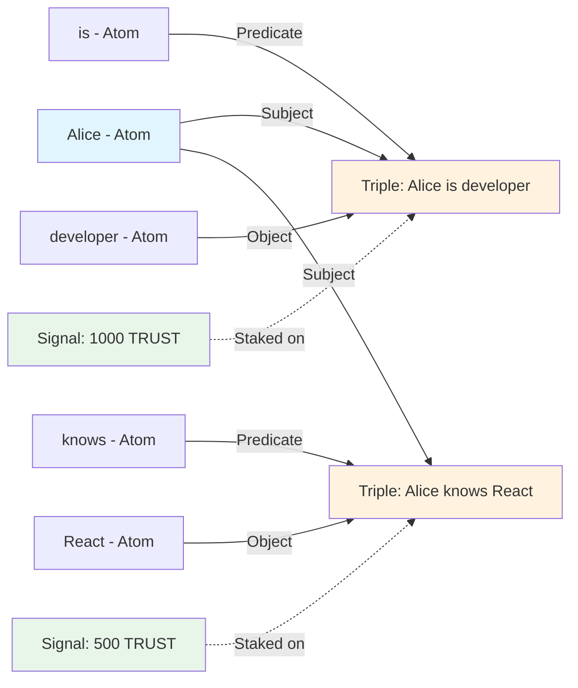

# Primitives Overview

Intuition's data model is built on three fundamental primitives that work together to create a rich, self-regulating knowledge graph:

<div className="uniform-card-grid">

<div className="uniform-card">
<h2 className="uniform-card-title">🔷 Atoms</h2>
<p className="uniform-card-content">
The basic entities or identifiers - unique decentralized identifiers for everything in existence. Think of them as the <strong>nodes</strong> in the knowledge graph.
</p>
</div>

<div className="uniform-card">
<h2 className="uniform-card-title">🔗 Triples</h2>
<p className="uniform-card-content">
Structured relationships or claims linking entities together in Subject-Predicate-Object format. These are the <strong>edges</strong> in the knowledge graph.
</p>
</div>

<div className="uniform-card">
<h2 className="uniform-card-title">📊 Signals</h2>
<p className="uniform-card-content">
The weight of trust or consensus behind each entity or claim, determined by community staking. These represent the <strong>edge weights</strong> in the graph.
</p>
</div>

</div>

---

## The Three Primitives Explained

### 🔷 Atoms: Universal Identifiers for Everything

An **Atom** is a unique decentralized identifier that can reference literally anything – from people and organizations to concepts, data points, or even raw bytes of information. Each Atom acts as a globally referenceable identity in the Intuition system, with an on-chain ID that serves as its permanent, verifiable address.

:::info What Makes Atoms Unique
Unlike traditional identifiers that are limited to URIs or specific data formats, Atoms can point to **arbitrary data (bytes)**. This means an Atom can reference:
- **Raw strings**: Direct text like "Alice", "is friend of", or "2024-01-15"
- **URIs**: Web pages, IPFS hashes, blockchain addresses
- **Binary data**: Images, documents, encrypted content
- **Structured data**: JSON objects, protocol buffers, or any serialized format
- **Abstract concepts**: Ideas, emotions, or theoretical constructs
:::

#### Real-World Atom Examples

<div style={{ backgroundColor: 'var(--ifm-background-color)', border: '2px solid var(--ifm-color-primary-darker)', borderRadius: '12px', padding: '20px', marginBottom: '20px' }}>

**Person Atom**
```
Atom ID: 0x123...
Data: "alice.eth" (ENS name as raw string)
```

**Concept Atom**
```
Atom ID: 0x456...
Data: "trustworthy" (abstract quality)
```

**Data Hash Atom**
```
Atom ID: 0x789...
Data: 0xabcd...ef12 (IPFS content hash as bytes)
```

**Date Atom**
```
Atom ID: 0xabc...
Data: "2024-01-15T09:00:00Z" (ISO timestamp)
```

**Smart Contract Atom**
```
Atom ID: 0xdef...
Data: 0x742d35...8930 (Ethereum contract address)
```

</div>

Atoms are sometimes called "identities" in the protocol because they give any entity – whether tangible or abstract – a persistent, verifiable digital identity that can be referenced and validated by anyone in the network.

---

### 🔗 Triples: Expressing Relationships as Claims

A **Triple** is a structured claim that follows the semantic format of **[Subject] – [Predicate] – [Object]**, where each component is itself an Atom. This creates a precise, machine-readable way to express facts, relationships, and assertions about the world.

#### Example Triple Structures

<div style={{ backgroundColor: 'var(--ifm-background-surface-color)', border: '1px solid var(--ifm-color-emphasis-300)', borderRadius: '12px', padding: '24px', margin: '24px 0' }}>

**🤝 Social Relationship**
<div style={{ backgroundColor: 'var(--ifm-code-background)', padding: '12px', borderRadius: '6px', marginBottom: '16px', marginTop: '8px' }}>
<code style={{ fontSize: '14px' }}>[Alice] — [is friend of] — [Bob]</code>
</div>
<p style={{ marginBottom: '24px', fontSize: '14px', color: 'var(--ifm-color-content-secondary)' }}>Each component is an Atom with its own ID, creating a verifiable claim about friendship.</p>

**🎓 Professional Credential**
<div style={{ backgroundColor: 'var(--ifm-code-background)', padding: '12px', borderRadius: '6px', marginBottom: '16px', marginTop: '8px' }}>
<code style={{ fontSize: '14px' }}>[Dr. Smith] — [has degree] — [Harvard Medical School]</code>
</div>
<p style={{ marginBottom: '24px', fontSize: '14px', color: 'var(--ifm-color-content-secondary)' }}>Expressing educational credentials as structured data.</p>

**🔗 Smart Contract Deployment**
<div style={{ backgroundColor: 'var(--ifm-code-background)', padding: '12px', borderRadius: '6px', marginBottom: '16px', marginTop: '8px' }}>
<code style={{ fontSize: '14px' }}>[UniswapV3] — [was deployed on] — [2021-05-05]</code>
</div>
<p style={{ marginBottom: '24px', fontSize: '14px', color: 'var(--ifm-color-content-secondary)' }}>Recording blockchain events as semantic relationships.</p>

**⭐ Product Rating**
<div style={{ backgroundColor: 'var(--ifm-code-background)', padding: '12px', borderRadius: '6px', marginBottom: '16px', marginTop: '8px' }}>
<code style={{ fontSize: '14px' }}>[iPhone 15] — [has rating] — [4.5 stars]</code>
</div>
<p style={{ marginBottom: '0', fontSize: '14px', color: 'var(--ifm-color-content-secondary)' }}>Capturing user sentiment and product quality metrics.</p>

</div>

:::tip Compositional Power
Triples can reference other Triples as Atoms, enabling arbitrarily complex statements. For example:
```
[[Alice is friend of Bob]] — [was established on] — [2024-01-01]
```
This meta-claim adds temporal context to the friendship relationship.
:::

In many contexts, Triples are also referred to as **Claims** or **Attestations** because they represent assertions that can be verified, disputed, or supported by the community.

---

### 📊 Signals: Quantified Trust Through Staking

**Signal** represents the aggregated attestation state of an Atom or Triple – essentially, how much the community trusts or believes in that piece of information. Signal is generated through economic staking, where users deposit tokens (like $TRUST) into an entity's vault to express their conviction.

<div className="uniform-card-grid-small">

<div className="uniform-card">
<h4 className="uniform-card-title">Positive Signal</h4>
<p className="uniform-card-content">
Users stake tokens to support an Atom or Triple, indicating they believe it's true, valuable, or important.
</p>
</div>

<div className="uniform-card">
<h4 className="uniform-card-title">Counter Signal</h4>
<p className="uniform-card-content">
Users can stake against claims they disagree with, creating a market for truth discovery.
</p>
</div>

<div className="uniform-card">
<h4 className="uniform-card-title">Dynamic Updates</h4>
<p className="uniform-card-content">
Signal changes in real-time as users stake, withdraw, or shift their positions, creating a living consensus.
</p>
</div>

</div>

#### How Signal Works

1. **Staking Mechanism**: Users deposit tokens into Atom or Triple vaults
2. **Weight Calculation**: More stake = stronger signal of trust/importance
3. **Relative Comparison**: Signal strength is evaluated relative to alternatives
4. **Economic Incentives**: Stakers earn fees from future deposits, encouraging early and accurate signaling

:::warning Important Distinction
Creating an Atom or Triple is different from signaling support for it. Creation alone doesn't constitute a Signal – only staking tokens does. A user can create an entity without staking, leaving it with zero initial Signal.
:::

---

## How the Primitives Work Together

The true power of Intuition emerges when these three primitives interact:

### Many-to-One Attestations

<div style={{ backgroundColor: 'var(--ifm-background-surface-color)', border: '2px solid var(--ifm-color-primary)', borderRadius: '12px', padding: '24px', margin: '24px 0' }}>

<p style={{ fontSize: '16px', marginBottom: '20px' }}>
Unlike traditional systems where a single authority issues certificates or attestations, Intuition enables <strong>many-to-one non-deterministic attestations</strong>:
</p>

<div style={{ display: 'grid', gap: '16px' }}>

<div style={{ display: 'flex', alignItems: 'flex-start', gap: '12px' }}>
<span style={{ fontSize: '20px', marginTop: '2px' }}>👥</span>
<div>
<strong>Multiple Validators</strong>
<p style={{ margin: '4px 0 0 0', fontSize: '14px', color: 'var(--ifm-color-content-secondary)' }}>Any number of users can signal their belief in an Atom or Triple</p>
</div>
</div>

<div style={{ display: 'flex', alignItems: 'flex-start', gap: '12px' }}>
<span style={{ fontSize: '20px', marginTop: '2px' }}>⚖️</span>
<div>
<strong>Weighted Consensus</strong>
<p style={{ margin: '4px 0 0 0', fontSize: '14px', color: 'var(--ifm-color-content-secondary)' }}>The aggregate Signal determines the community's confidence level</p>
</div>
</div>

<div style={{ display: 'flex', alignItems: 'flex-start', gap: '12px' }}>
<span style={{ fontSize: '20px', marginTop: '2px' }}>🛡️</span>
<div>
<strong>No Single Point of Failure</strong>
<p style={{ margin: '4px 0 0 0', fontSize: '14px', color: 'var(--ifm-color-content-secondary)' }}>Truth emerges from collective validation, not central authority</p>
</div>
</div>

<div style={{ display: 'flex', alignItems: 'flex-start', gap: '12px' }}>
<span style={{ fontSize: '20px', marginTop: '2px' }}>🔄</span>
<div>
<strong>Dynamic Evolution</strong>
<p style={{ margin: '4px 0 0 0', fontSize: '14px', color: 'var(--ifm-color-content-secondary)' }}>Attestations can change over time as new information emerges</p>
</div>
</div>

</div>

</div>

### Example: Building a Reputation Graph

Consider how these primitives combine to create a decentralized reputation system:



In this example:
- **Atoms** define the entities (Alice, developer, React)
- **Triples** express relationships (Alice is a developer, Alice knows React)
- **Signals** quantify community confidence (1000 TRUST backs the developer claim)

---

## Key Benefits of This Architecture

<div className="uniform-card-grid">

<div className="uniform-card">
<h3 className="uniform-card-title">🌐 Universal Composability</h3>
<p className="uniform-card-content">
Any data type can become an Atom, and any relationship can be expressed as a Triple, creating infinite possibilities for knowledge representation.
</p>
</div>

<div className="uniform-card">
<h3 className="uniform-card-title">🔄 Self-Regulating Truth</h3>
<p className="uniform-card-content">
Economic incentives through Signal staking create a market for truth, where accurate information naturally accumulates more support.
</p>
</div>

<div className="uniform-card">
<h3 className="uniform-card-title">🤝 Interoperability</h3>
<p className="uniform-card-content">
Standardized semantic structure enables different applications to understand and build upon the same knowledge graph.
</p>
</div>

<div className="uniform-card">
<h3 className="uniform-card-title">📈 Progressive Trust</h3>
<p className="uniform-card-content">
Trust isn't binary – it's a spectrum measured by Signal strength, allowing for nuanced representation of confidence and belief.
</p>
</div>

</div>

---

## Getting Started with Primitives

To begin working with Intuition's primitives, consider these pathways:

### For Developers
1. **Create Atoms** for entities in your domain (users, products, concepts)
2. **Define Triples** to express relationships between those entities
3. **Monitor Signals** to understand community consensus
4. **Build applications** that leverage the knowledge graph

### For Users
1. **Discover existing Atoms** relevant to your interests
2. **Stake on Triples** you believe are true or important
3. **Create new Claims** to contribute knowledge
4. **Earn rewards** from successful early signaling

### For Data Scientists
1. **Analyze Signal patterns** to identify emerging truths
2. **Query the Triple graph** for relationship insights
3. **Track Atom evolution** over time
4. **Build prediction models** based on Signal dynamics

---

:::info Remember
The beauty of Intuition's primitives lies in their simplicity and composability. Three simple concepts – Atoms, Triples, and Signals – combine to create a powerful system for decentralized knowledge and trust.
:::